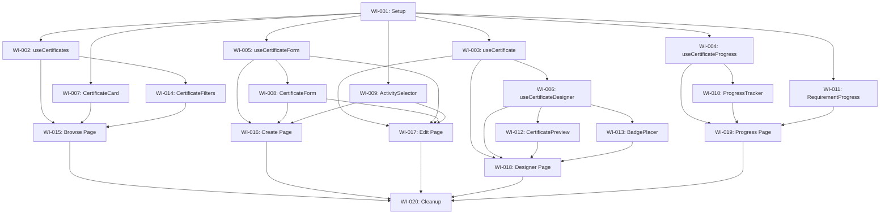

# VIBE-0007 Implementation Plan: Certificates Refactor

## Overview

This document breaks down **VIBE-0007** (Certificates Pages Refactor - 2,333 lines across 5 files) into discrete work items suitable for agentic AI development using a **Test-Driven Development (TDD)** approach.

### Current State Analysis

| File | Lines | Key Functions | Complexity |
|------|-------|---------------|------------|
| `certificates/designer/page.tsx` | 858 | handleImageUpload, uploadImage, handleRemoveImage, handleSaveDraft, handleSubmit | Very High - canvas positioning, drag-drop, image uploads |
| `certificates/[id]/edit/page.tsx` | 577 | loadCertificate, loadActivities, addActivity, removeActivity, moveActivity, handleSubmit | High - full CRUD + activity management |
| `certificates/create/page.tsx` | 455 | loadActivities, addActivity, removeActivity, moveActivity, handleSubmit | Medium - overlaps heavily with edit |
| `certificates/browse/page.tsx` | 428 | handleSearchChange, handleSortChange, handleEnroll | Medium - filtering/search/pagination |
| `my-certificates/[id]/progress/page.tsx` | 415 | fetchProgress, handleRefresh, handleDownloadCertificate, handleShare, copyToClipboard | Medium - progress display + PDF download |

### Target Architecture

```
src/features/certificates/
├── components/
│   ├── CertificateCard.tsx           (~80 lines)
│   ├── CertificateForm.tsx           (~150 lines)
│   ├── CertificatePreview.tsx        (~120 lines)
│   ├── BadgePlacer.tsx               (~150 lines)
│   ├── RequirementsEditor.tsx        (~120 lines)
│   ├── ActivitySelector.tsx          (~100 lines)
│   ├── ProgressTracker.tsx           (~100 lines)
│   ├── RequirementProgress.tsx       (~80 lines)
│   ├── CertificateFilters.tsx        (~80 lines)
│   └── index.ts
├── hooks/
│   ├── useCertificate.ts             (~80 lines)
│   ├── useCertificates.ts            (~60 lines)
│   ├── useCertificateProgress.ts     (~80 lines)
│   ├── useCertificateForm.ts         (~100 lines)
│   ├── useCertificateDesigner.ts     (~120 lines)
│   └── index.ts
├── types.ts                          (~60 lines)
├── utils.ts                          (~40 lines)
└── index.ts
```

---

## Work Items

### Phase 1: Foundation Setup (Pre-requisite)

#### WI-001: Setup Feature Module Structure
**Type:** Setup  
**Effort:** XS (15 min)  
**Dependencies:** None

**Description:**
Create the base directory structure and type definitions for the certificates feature module.

**Tasks:**
1. Create directory structure:
   - `src/features/certificates/components/`
   - `src/features/certificates/hooks/`
   - `tests/unit/features/certificates/components/`
   - `tests/unit/features/certificates/hooks/`

2. Create `src/features/certificates/types.ts` with shared interfaces extracted from existing pages

3. Create barrel exports (`index.ts` files)

**Files to Create:**
- `src/features/certificates/types.ts`
- `src/features/certificates/index.ts`
- `src/features/certificates/components/index.ts`
- `src/features/certificates/hooks/index.ts`

**Acceptance Criteria:**
- [ ] Directory structure exists
- [ ] Type definitions compile without errors
- [ ] Barrel exports work

---

### Phase 2: Hooks Development (TDD)

#### WI-002: useCertificates Hook
**Type:** Hook  
**Effort:** S (30 min)  
**Dependencies:** WI-001

**Description:**
Extract certificate list fetching logic from `browse/page.tsx` into a reusable hook.

**TDD Approach:**

1. **Write Tests First** (`tests/unit/features/certificates/hooks/useCertificates.test.ts`):

```typescript
// Test Cases to Implement:
describe('useCertificates', () => {
  describe('Initial State', () => {
    it('returns loading=true initially')
    it('returns empty certificates array initially')
    it('returns null error initially')
  })
  
  describe('Data Fetching', () => {
    it('fetches certificates on mount')
    it('sets loading=false after fetch completes')
    it('populates certificates array on successful fetch')
    it('handles empty response gracefully')
  })
  
  describe('Filtering', () => {
    it('filters by search query')
    it('debounces search input')
    it('filters by status')
  })
  
  describe('Sorting', () => {
    it('sorts by name ascending')
    it('sorts by name descending')
    it('sorts by date created')
  })
  
  describe('Error Handling', () => {
    it('sets error on fetch failure')
    it('provides retry function')
  })
})
```

2. **Implement Hook** (`src/features/certificates/hooks/useCertificates.ts`):

```typescript
interface UseCertificatesOptions {
  initialSearch?: string
  initialStatus?: CertificateStatus | 'all'
  initialSort?: SortOption
}

interface UseCertificatesReturn {
  certificates: Certificate[]
  loading: boolean
  error: Error | null
  search: string
  setSearch: (query: string) => void
  status: CertificateStatus | 'all'
  setStatus: (status: CertificateStatus | 'all') => void
  sortBy: SortOption
  setSortBy: (sort: SortOption) => void
  refetch: () => Promise<void>
}

export function useCertificates(options?: UseCertificatesOptions): UseCertificatesReturn
```

**Acceptance Criteria:**
- [ ] All tests pass
- [ ] Hook can be used in browse page
- [ ] Browse page code reduced by ~100 lines

---

#### WI-003: useCertificate Hook (Single Certificate)
**Type:** Hook  
**Effort:** S (30 min)  
**Dependencies:** WI-001

**Description:**
Extract single certificate fetching logic from `[id]/edit/page.tsx` into a reusable hook.

**TDD Approach:**

1. **Write Tests First** (`tests/unit/features/certificates/hooks/useCertificate.test.ts`):

```typescript
describe('useCertificate', () => {
  describe('Initial State', () => {
    it('returns loading=true when id is provided')
    it('returns loading=false when id is undefined')
    it('returns null certificate initially')
  })
  
  describe('Data Fetching', () => {
    it('fetches certificate by id on mount')
    it('includes activities in response')
    it('refetches when id changes')
  })
  
  describe('Mutations', () => {
    it('provides updateCertificate function')
    it('optimistically updates local state')
    it('reverts on API error')
    it('provides saving state during mutation')
  })
  
  describe('Error Handling', () => {
    it('sets error on 404 response')
    it('sets error on network failure')
    it('provides retry function')
  })
})
```

2. **Implement Hook** (`src/features/certificates/hooks/useCertificate.ts`)

**Acceptance Criteria:**
- [ ] All tests pass
- [ ] Hook can be used in edit and designer pages
- [ ] Supports optimistic updates

---

#### WI-004: useCertificateProgress Hook
**Type:** Hook  
**Effort:** S (30 min)  
**Dependencies:** WI-001

**Description:**
Extract progress fetching logic from `my-certificates/[id]/progress/page.tsx`.

**TDD Approach:**

1. **Write Tests First** (`tests/unit/features/certificates/hooks/useCertificateProgress.test.ts`):

```typescript
describe('useCertificateProgress', () => {
  describe('Data Fetching', () => {
    it('fetches progress data on mount')
    it('calculates overall percentage correctly')
    it('maps activity statuses correctly')
  })
  
  describe('Actions', () => {
    it('provides refresh function')
    it('provides downloadCertificate function when completed')
    it('provides share function with verification URL')
  })
  
  describe('PDF Download', () => {
    it('triggers PDF generation on download')
    it('handles download failure gracefully')
    it('shows downloading state during generation')
  })
})
```

2. **Implement Hook** (`src/features/certificates/hooks/useCertificateProgress.ts`)

**Acceptance Criteria:**
- [ ] All tests pass
- [ ] Progress page code reduced by ~100 lines
- [ ] PDF download logic encapsulated

---

#### WI-005: useCertificateForm Hook
**Type:** Hook  
**Effort:** M (45 min)  
**Dependencies:** WI-001

**Description:**
Extract shared form logic between create and edit pages.

**TDD Approach:**

1. **Write Tests First** (`tests/unit/features/certificates/hooks/useCertificateForm.test.ts`):

```typescript
describe('useCertificateForm', () => {
  describe('Initial State', () => {
    it('initializes with empty values for create mode')
    it('initializes with certificate values for edit mode')
  })
  
  describe('Field Updates', () => {
    it('updates name field')
    it('updates description field')
    it('updates organization name')
    it('updates signatory name')
    it('updates certificate statement')
    it('updates student instructions')
  })
  
  describe('Activity Management', () => {
    it('adds activity to list')
    it('prevents duplicate activities')
    it('removes activity from list')
    it('moves activity up in order')
    it('moves activity down in order')
    it('reorders activities correctly')
    it('toggles required flag on activity')
  })
  
  describe('Validation', () => {
    it('validates required fields')
    it('validates at least one activity')
    it('returns validation errors')
    it('clears errors on valid input')
  })
  
  describe('Submission', () => {
    it('calls onCreate for new certificates')
    it('calls onUpdate for existing certificates')
    it('sets submitting state during API call')
    it('handles submission error')
    it('resets form on successful create')
  })
})
```

2. **Implement Hook** (`src/features/certificates/hooks/useCertificateForm.ts`)

**Acceptance Criteria:**
- [ ] All tests pass
- [ ] Create and edit pages can share this hook
- [ ] Combined create + edit page code reduced by ~200 lines

---

#### WI-006: useCertificateDesigner Hook
**Type:** Hook  
**Effort:** L (1 hour)  
**Dependencies:** WI-003

**Description:**
Extract designer-specific logic (image uploads, badge positioning, preview generation).

**TDD Approach:**

1. **Write Tests First** (`tests/unit/features/certificates/hooks/useCertificateDesigner.test.ts`):

```typescript
describe('useCertificateDesigner', () => {
  describe('Image Upload', () => {
    it('uploads logo image')
    it('uploads background image')
    it('validates image file type')
    it('validates image file size')
    it('shows upload progress')
    it('handles upload failure')
    it('removes uploaded image')
  })
  
  describe('Badge Placement', () => {
    it('tracks badge positions')
    it('updates badge position on drag')
    it('validates badge bounds within canvas')
    it('saves badge positions to certificate')
  })
  
  describe('Logo Position', () => {
    it('sets logo position (top-left, top-center, top-right)')
    it('persists logo position')
  })
  
  describe('QR Code Position', () => {
    it('sets QR position (bottom-left, bottom-center, bottom-right)')
    it('persists QR position')
  })
  
  describe('Draft & Submit', () => {
    it('saves certificate as draft')
    it('submits certificate for approval')
    it('validates before submission')
  })
})
```

2. **Implement Hook** (`src/features/certificates/hooks/useCertificateDesigner.ts`)

**Acceptance Criteria:**
- [ ] All tests pass
- [ ] Designer page complexity reduced significantly
- [ ] Image upload logic encapsulated

---

### Phase 3: Components Development (TDD)

#### WI-007: CertificateCard Component
**Type:** Component  
**Effort:** S (30 min)  
**Dependencies:** WI-001

**Description:**
Extract certificate card display from browse page.

**TDD Approach:**

1. **Write Tests First** (`tests/unit/features/certificates/components/CertificateCard.test.tsx`):

```typescript
describe('CertificateCard', () => {
  describe('Display', () => {
    it('renders certificate name')
    it('renders organization name when present')
    it('renders activity count')
    it('renders enrollment count when applicable')
    it('renders logo image when present')
    it('renders placeholder when no logo')
  })
  
  describe('Status Badge', () => {
    it('shows Published badge for published certificates')
    it('shows Draft badge for draft certificates')
    it('shows Pending badge for pending approval')
    it('shows Enrolled badge when user is enrolled')
  })
  
  describe('Actions', () => {
    it('shows Enroll button when not enrolled')
    it('shows View Progress when enrolled')
    it('shows Edit button for creators')
    it('calls onEnroll when Enroll clicked')
    it('links to progress page when View Progress clicked')
  })
  
  describe('Styling', () => {
    it('applies hover state styles')
    it('uses different border color based on status')
  })
})
```

2. **Implement Component** (`src/features/certificates/components/CertificateCard.tsx`)

**Acceptance Criteria:**
- [ ] All tests pass
- [ ] Component is used in browse page
- [ ] Browse page code reduced by ~80 lines

---

#### WI-008: CertificateForm Component
**Type:** Component  
**Effort:** M (45 min)  
**Dependencies:** WI-005

**Description:**
Create shared form component for create and edit pages.

**TDD Approach:**

1. **Write Tests First** (`tests/unit/features/certificates/components/CertificateForm.test.tsx`):

```typescript
describe('CertificateForm', () => {
  describe('Fields', () => {
    it('renders name input')
    it('renders organization input')
    it('renders program name input')
    it('renders signatory name input')
    it('renders certificate statement textarea')
    it('renders student instructions textarea')
  })
  
  describe('Edit Mode', () => {
    it('populates fields with certificate data')
    it('shows "Save Changes" button')
    it('disables name field when not creator')
  })
  
  describe('Create Mode', () => {
    it('shows empty fields')
    it('shows "Create Certificate" button')
  })
  
  describe('Activity Selector Section', () => {
    it('renders ActivitySelector component')
    it('passes selected activities to selector')
    it('handles activity selection')
    it('handles activity removal')
    it('handles activity reordering')
  })
  
  describe('Validation Display', () => {
    it('shows error for empty name')
    it('shows error when no activities selected')
    it('clears errors on correction')
  })
  
  describe('Submission', () => {
    it('calls onSubmit with form data')
    it('shows loading state during submission')
    it('disables submit button when invalid')
  })
})
```

2. **Implement Component** (`src/features/certificates/components/CertificateForm.tsx`)

**Acceptance Criteria:**
- [ ] All tests pass
- [ ] Component works in both create and edit modes
- [ ] Reduces duplication between create/edit pages by ~300 lines combined

---

#### WI-009: ActivitySelector Component
**Type:** Component  
**Effort:** M (45 min)  
**Dependencies:** WI-001

**Description:**
Extract activity selection/ordering UI shared between designer, create, and edit pages.

**TDD Approach:**

1. **Write Tests First** (`tests/unit/features/certificates/components/ActivitySelector.test.tsx`):

```typescript
describe('ActivitySelector', () => {
  describe('Activity Search', () => {
    it('shows search input')
    it('filters activities by name')
    it('debounces search input')
    it('shows no results message')
  })
  
  describe('Available Activities List', () => {
    it('renders available activities')
    it('shows activity name and type')
    it('shows group name when applicable')
    it('hides already selected activities')
  })
  
  describe('Selected Activities List', () => {
    it('renders selected activities in order')
    it('shows sequence number')
    it('shows required toggle')
    it('shows remove button')
    it('shows move up/down buttons')
    it('disables move up on first item')
    it('disables move down on last item')
  })
  
  describe('Selection Actions', () => {
    it('calls onAdd when activity clicked')
    it('calls onRemove when remove clicked')
    it('calls onMove with direction when move clicked')
    it('calls onToggleRequired when toggle clicked')
  })
  
  describe('Empty States', () => {
    it('shows empty message when no activities selected')
    it('shows loading state while fetching activities')
  })
})
```

2. **Implement Component** (`src/features/certificates/components/ActivitySelector.tsx`)

**Acceptance Criteria:**
- [ ] All tests pass
- [ ] Replaces inline activity selection in 3+ pages
- [ ] Reduces total code by ~150 lines

---

#### WI-010: ProgressTracker Component
**Type:** Component  
**Effort:** S (30 min)  
**Dependencies:** WI-004

**Description:**
Extract progress display component from my-certificates progress page.

**TDD Approach:**

1. **Write Tests First** (`tests/unit/features/certificates/components/ProgressTracker.test.tsx`):

```typescript
describe('ProgressTracker', () => {
  describe('Overall Progress', () => {
    it('displays overall percentage')
    it('renders progress bar')
    it('shows encouraging message for incomplete')
    it('shows congratulations for 100%')
  })
  
  describe('Activity Progress List', () => {
    it('renders RequirementProgress for each activity')
    it('shows activity count header')
    it('handles empty activities list')
  })
  
  describe('Completion Actions', () => {
    it('shows claim/download button when 100%')
    it('hides claim button when incomplete')
    it('shows share button when completed')
  })
  
  describe('Certificate Info', () => {
    it('displays certificate name')
    it('displays organization name')
    it('displays enrollment date')
    it('displays completion date when completed')
  })
})
```

2. **Implement Component** (`src/features/certificates/components/ProgressTracker.tsx`)

**Acceptance Criteria:**
- [ ] All tests pass
- [ ] Progress page simplified significantly
- [ ] Component matches existing dashboard CertificateProgress patterns

---

#### WI-011: RequirementProgress Component
**Type:** Component  
**Effort:** XS (20 min)  
**Dependencies:** WI-001

**Description:**
Single requirement/activity progress display within ProgressTracker.

**TDD Approach:**

1. **Write Tests First** (`tests/unit/features/certificates/components/RequirementProgress.test.tsx`):

```typescript
describe('RequirementProgress', () => {
  describe('Status Display', () => {
    it('shows passed icon and "Passed" text for passed status')
    it('shows failed icon and "Try Again" for failed status')
    it('shows in-progress icon and "Continue" for in_progress')
    it('shows not-started icon and "Start" for not_started')
  })
  
  describe('Activity Info', () => {
    it('displays activity name')
    it('shows Required badge when required')
    it('shows Optional badge when not required')
    it('links to activity page')
  })
  
  describe('Score Display', () => {
    it('shows score when available')
    it('hides score when not available')
  })
})
```

2. **Implement Component** (`src/features/certificates/components/RequirementProgress.tsx`)

**Acceptance Criteria:**
- [ ] All tests pass
- [ ] Component is used by ProgressTracker

---

#### WI-012: CertificatePreview Component Refactor
**Type:** Component  
**Effort:** S (30 min)  
**Dependencies:** WI-001

**Description:**
Refactor existing CertificatePreview (designer/components) to be more reusable.

**TDD Approach:**

1. **Write Tests First** (`tests/unit/features/certificates/components/CertificatePreview.test.tsx`):

```typescript
describe('CertificatePreview', () => {
  describe('Rendering', () => {
    it('renders certificate name')
    it('renders organization name')
    it('renders signatory name')
    it('renders certificate statement')
    it('renders logo at correct position')
    it('renders QR code at correct position')
    it('renders background image if set')
  })
  
  describe('Badges', () => {
    it('renders badge icons at saved positions')
    it('renders earned badges differently from unearned')
  })
  
  describe('Student Info Placeholders', () => {
    it('shows "[Student Name]" placeholder')
    it('shows "[Date]" placeholder')
    it('shows "[Verification Code]" placeholder')
  })
  
  describe('Sizing', () => {
    it('maintains aspect ratio')
    it('scales content appropriately')
  })
})
```

2. **Refactor Component** (`src/features/certificates/components/CertificatePreview.tsx`)

**Acceptance Criteria:**
- [ ] All tests pass
- [ ] Existing preview functionality preserved
- [ ] Component is reusable in multiple contexts

---

#### WI-013: BadgePlacer Component
**Type:** Component  
**Effort:** L (1 hour)  
**Dependencies:** WI-006

**Description:**
Extract drag-drop badge placement canvas from designer page.

**TDD Approach:**

1. **Write Tests First** (`tests/unit/features/certificates/components/BadgePlacer.test.tsx`):

```typescript
describe('BadgePlacer', () => {
  describe('Canvas Rendering', () => {
    it('renders canvas with correct dimensions')
    it('renders certificate background')
    it('renders available badges palette')
  })
  
  describe('Badge Palette', () => {
    it('shows available badges')
    it('allows dragging badge from palette')
    it('shows badge name on hover')
  })
  
  describe('Placed Badges', () => {
    it('renders placed badges at correct positions')
    it('allows dragging placed badges')
    it('allows removing placed badges')
    it('snaps to grid when enabled')
  })
  
  describe('Drag and Drop', () => {
    it('calls onBadgePlaced when badge dropped on canvas')
    it('calls onBadgeMoved when badge repositioned')
    it('calls onBadgeRemoved when badge removed')
    it('prevents badge placement outside canvas bounds')
  })
  
  describe('Positioning Controls', () => {
    it('shows logo position selector')
    it('shows QR code position selector')
    it('updates positions when changed')
  })
})
```

2. **Implement Component** (`src/features/certificates/components/BadgePlacer.tsx`)

**Acceptance Criteria:**
- [ ] All tests pass
- [ ] Drag-drop functionality works
- [ ] Designer page complexity reduced by ~300 lines

---

#### WI-014: CertificateFilters Component
**Type:** Component  
**Effort:** S (25 min)  
**Dependencies:** WI-002

**Description:**
Extract search/filter/sort controls from browse page.

**TDD Approach:**

1. **Write Tests First** (`tests/unit/features/certificates/components/CertificateFilters.test.tsx`):

```typescript
describe('CertificateFilters', () => {
  describe('Search', () => {
    it('renders search input')
    it('calls onSearchChange when typing')
    it('shows clear button when search has value')
    it('clears search when clear clicked')
  })
  
  describe('Status Filter', () => {
    it('renders status dropdown')
    it('shows All, Published, Draft options')
    it('calls onStatusChange when selected')
    it('shows current selection')
  })
  
  describe('Sort', () => {
    it('renders sort dropdown')
    it('shows sort options (name, date, enrollments)')
    it('calls onSortChange when selected')
    it('shows current sort')
  })
  
  describe('Layout', () => {
    it('renders inputs in horizontal layout')
    it('is responsive on mobile')
  })
})
```

2. **Implement Component** (`src/features/certificates/components/CertificateFilters.tsx`)

**Acceptance Criteria:**
- [ ] All tests pass
- [ ] Browse page filter section replaced
- [ ] Browse page reduced by ~60 lines

---

### Phase 4: Page Integration

#### WI-015: Refactor Browse Page
**Type:** Integration  
**Effort:** M (45 min)  
**Dependencies:** WI-002, WI-007, WI-014

**Description:**
Integrate extracted components and hooks into browse page.

**Tasks:**
1. Replace inline certificate fetching with `useCertificates` hook
2. Replace inline filters with `CertificateFilters` component
3. Replace inline card rendering with `CertificateCard` component
4. Verify all existing functionality preserved

**Target:** Page under 100 lines (from 428)

**Acceptance Criteria:**
- [ ] Page renders correctly
- [ ] Search/filter/sort work
- [ ] Enrollment works
- [ ] Page is under 120 lines

---

#### WI-016: Refactor Create Page
**Type:** Integration  
**Effort:** S (30 min)  
**Dependencies:** WI-005, WI-008, WI-009

**Description:**
Integrate extracted components and hooks into create page.

**Tasks:**
1. Replace inline form with `CertificateForm` component
2. Use `useCertificateForm` hook for state management
3. Verify creation flow works

**Target:** Page under 80 lines (from 455)

**Acceptance Criteria:**
- [ ] Page renders correctly
- [ ] Form validation works
- [ ] Activity selection works
- [ ] Certificate creation works
- [ ] Page is under 100 lines

---

#### WI-017: Refactor Edit Page
**Type:** Integration  
**Effort:** S (30 min)  
**Dependencies:** WI-003, WI-005, WI-008, WI-009

**Description:**
Integrate extracted components and hooks into edit page.

**Tasks:**
1. Replace inline fetching with `useCertificate` hook
2. Replace inline form with `CertificateForm` component
3. Use `useCertificateForm` hook for state management
4. Verify update flow works

**Target:** Page under 80 lines (from 577)

**Acceptance Criteria:**
- [ ] Page renders correctly
- [ ] Existing certificate data loads
- [ ] Updates save correctly
- [ ] Page is under 100 lines

---

#### WI-018: Refactor Designer Page
**Type:** Integration  
**Effort:** L (1 hour)  
**Dependencies:** WI-003, WI-006, WI-012, WI-013

**Description:**
Integrate extracted components and hooks into designer page.

**Tasks:**
1. Use `useCertificate` hook for data fetching
2. Use `useCertificateDesigner` hook for designer logic
3. Use `CertificatePreview` for live preview
4. Use `BadgePlacer` for canvas/drag-drop
5. Verify all designer functionality works

**Target:** Page under 200 lines (from 858) - complexity is acceptable

**Acceptance Criteria:**
- [ ] Page renders correctly
- [ ] Image upload works
- [ ] Badge placement works
- [ ] Preview updates live
- [ ] Save/submit works
- [ ] Page is under 200 lines

---

#### WI-019: Refactor Progress Page
**Type:** Integration  
**Effort:** S (30 min)  
**Dependencies:** WI-004, WI-010, WI-011

**Description:**
Integrate extracted components and hooks into progress page.

**Tasks:**
1. Replace inline fetching with `useCertificateProgress` hook
2. Replace inline progress display with `ProgressTracker` component
3. Verify PDF download and share functionality

**Target:** Page under 100 lines (from 415)

**Acceptance Criteria:**
- [ ] Page renders correctly
- [ ] Progress displays correctly
- [ ] PDF download works
- [ ] Share functionality works
- [ ] Page is under 120 lines

---

### Phase 5: Cleanup & Documentation

#### WI-020: Final Cleanup and Documentation
**Type:** Cleanup  
**Effort:** S (30 min)  
**Dependencies:** WI-015 through WI-019

**Description:**
Final cleanup, documentation, and verification.

**Tasks:**
1. Remove dead code from original pages
2. Update imports throughout codebase
3. Verify all tests pass
4. Update component documentation
5. Update VIBE-0007 ticket as complete

**Acceptance Criteria:**
- [ ] All tests pass (unit + existing e2e)
- [ ] No unused code remains
- [ ] Feature module is complete and documented
- [ ] All pages meet line count targets

---

## Summary

| Phase | Work Items | Estimated Time |
|-------|------------|----------------|
| 1. Foundation | WI-001 | 15 min |
| 2. Hooks (TDD) | WI-002 to WI-006 | 3.5 hours |
| 3. Components (TDD) | WI-007 to WI-014 | 4.5 hours |
| 4. Page Integration | WI-015 to WI-019 | 3.5 hours |
| 5. Cleanup | WI-020 | 30 min |
| **Total** | **20 Work Items** | **~12 hours** |

## Execution Order (Recommended)



## Notes for AI Agent

1. **TDD is mandatory** - Always write tests first before implementing hooks/components
2. **Run tests frequently** - After each implementation, verify tests pass with `npm run test`
3. **Small commits** - Commit after each work item completion
4. **Preserve behavior** - The refactor should not change any user-facing behavior
5. **Use existing patterns** - Follow the patterns established in `src/features/case-mode/`
6. **Type safety** - Ensure all TypeScript types are properly defined and used
