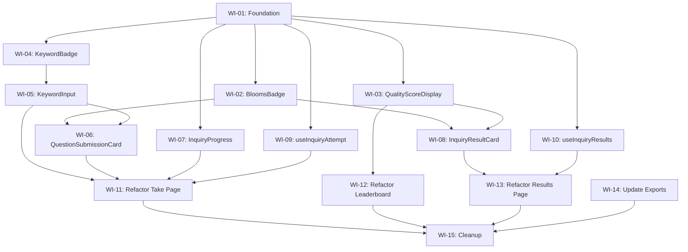

# VIBE-0009: Inquiry Mode Refactor - Work Items Index

## Overview

This document provides an index of all work items for the Inquiry Mode refactor. The plan follows a **Test-Driven Development (TDD)** approach where unit tests are written first before implementation.

### Current State

| File | Lines | Purpose |
|------|-------|---------|
| `inquiry/take/inquiry-take-client.tsx` | 588 | Student: take inquiry |
| `inquiry/leaderboard/page.tsx` | 502 | Leaderboard display |
| `inquiry/[attemptId]/results/page.tsx` | 389 | View results |
| **Total** | **1,479** | |

### Target State

| File | Target Lines |
|------|--------------|
| Take page | < 120 |
| Leaderboard | < 150 |
| Results page | < 100 |
| **New components** | 7 |
| **New hooks** | 2 |

---

## Work Items by Phase

### Phase 1: Foundation (Est: 1 hour)

| WI | Title | Effort | Blocks |
|----|-------|--------|--------|
| [WI-01](./VIBE-0009-WI01-foundation-types.md) | Create Module Structure & Types | S | WI-02 to WI-15 |

### Phase 2: UI Components with Tests (Est: 3 hours)

| WI | Title | Effort | Dependencies |
|----|-------|--------|--------------|
| [WI-02](./VIBE-0009-WI02-blooms-badge.md) | BloomsBadge Component | S | WI-01 |
| [WI-03](./VIBE-0009-WI03-quality-score-display.md) | QualityScoreDisplay Component | S | WI-01 |
| [WI-04](./VIBE-0009-WI04-keyword-badge.md) | KeywordBadge Component | S | WI-01 |
| [WI-05](./VIBE-0009-WI05-keyword-input.md) | KeywordInput Component | M | WI-04 |
| [WI-06](./VIBE-0009-WI06-question-submission-card.md) | QuestionSubmissionCard Component | M | WI-02, WI-05 |
| [WI-07](./VIBE-0009-WI07-inquiry-progress.md) | InquiryProgress Component | S | WI-01 |
| [WI-08](./VIBE-0009-WI08-inquiry-result-card.md) | InquiryResultCard Component | M | WI-02, WI-03 |

### Phase 3: Custom Hooks with Tests (Est: 2 hours)

| WI | Title | Effort | Dependencies |
|----|-------|--------|--------------|
| [WI-09](./VIBE-0009-WI09-use-inquiry-attempt.md) | useInquiryAttempt Hook | L | WI-01 |
| [WI-10](./VIBE-0009-WI10-use-inquiry-results.md) | useInquiryResults Hook | S | WI-01 |

### Phase 4: Page Refactoring (Est: 2 hours)

| WI | Title | Effort | Dependencies |
|----|-------|--------|--------------|
| [WI-11](./VIBE-0009-WI11-refactor-take-page.md) | Refactor Take Page | L | WI-05, WI-06, WI-07, WI-09 |
| [WI-12](./VIBE-0009-WI12-refactor-leaderboard.md) | Refactor Leaderboard Page | M | WI-03 |
| [WI-13](./VIBE-0009-WI13-refactor-results-page.md) | Refactor Results Page | M | WI-08, WI-10 |

### Phase 5: Integration & Cleanup (Est: 1 hour)

| WI | Title | Effort | Dependencies |
|----|-------|--------|--------------|
| [WI-14](./VIBE-0009-WI14-update-exports.md) | Update Index Exports | XS | WI-02 to WI-10 |
| [WI-15](./VIBE-0009-WI15-final-cleanup.md) | Final Cleanup | S | WI-11 to WI-14 |

---

## Dependency Graph



---

## Parallel Execution Groups

For maximum efficiency, work items can be executed in parallel groups:

**Group 1** (After WI-01):
- WI-02, WI-03, WI-04, WI-07, WI-09, WI-10

**Group 2** (After Group 1):
- WI-05 (requires WI-04)
- WI-08 (requires WI-02, WI-03)

**Group 3** (After Group 2):
- WI-06 (requires WI-02, WI-05)

**Group 4** (After Group 3):
- WI-11, WI-12, WI-13 (page refactors)

**Group 5** (After Group 4):
- WI-14, WI-15 (finalization)

---

## Related Documents

- **Full Implementation Plan**: [VIBE-0009-inquiry-mode-refactor-plan.md](../implementation-plans/VIBE-0009-inquiry-mode-refactor-plan.md)
- **Original Ticket**: [VIBE-0009-inquiry-mode-refactor.md](./VIBE-0009-inquiry-mode-refactor.md)

---

## TDD Checklist for Each Work Item

For components and hooks (WI-02 to WI-10):
1. ✅ Write failing tests first
2. ✅ Run tests to confirm they fail
3. ✅ Implement minimum code to pass
4. ✅ Run tests to confirm they pass
5. ✅ Refactor if needed
6. ✅ Update exports

---

## Testing Commands

```bash
# Run all inquiry-mode tests
npm test -- src/features/inquiry-mode

# Run specific component test
npm test -- src/features/inquiry-mode/components/__tests__/BloomsBadge.test.tsx

# Run with coverage
npm test -- --coverage src/features/inquiry-mode

# Watch mode during development
npm test -- --watch src/features/inquiry-mode
```
