# VIBE-0005: Activity Pages Refactor - Work Items Breakdown

## Overview

This document breaks down the VIBE-0005 ticket into discrete, actionable work items for an agentic AI to implement. Each work item follows a **TDD (Test-Driven Development)** approach: write unit tests first, then implement the component/hook to make tests pass.

### Source Files to Refactor
| File | Lines | Target |
|------|-------|--------|
| `src/app/(dashboard)/activities/create/page.tsx` | 775 | ~100 lines |
| `src/app/(dashboard)/activities/[id]/page.tsx` | 691 | ~100 lines |
| **Total** | **1,466** | **~200** |

### Target Structure
```
src/features/activities/
├── components/
│   ├── ActivityForm/
│   │   ├── BasicInfoFields.tsx      (~100 lines)
│   │   ├── ModeSelector.tsx         (~80 lines)  [exists: reuse from components/modes/]
│   │   ├── GroupSelector.tsx        (~80 lines)
│   │   ├── GeneralSettings.tsx      (~100 lines)
│   │   └── index.ts
│   ├── ModeSettings/
│   │   ├── ExamSettingsForm.tsx     (~120 lines)
│   │   ├── InquirySettingsForm.tsx  (~150 lines)
│   │   ├── CaseSettingsForm.tsx     (~150 lines)
│   │   └── index.ts
│   ├── ActivityDetail/
│   │   ├── ActivityHeader.tsx       (~80 lines)
│   │   ├── ActivityStats.tsx        (~80 lines)
│   │   ├── ActivityActions.tsx      (~80 lines)
│   │   └── index.ts
│   ├── ModeContent/
│   │   ├── OpenModeContent.tsx      (~60 lines)
│   │   ├── ExamModeContent.tsx      (~80 lines)
│   │   ├── InquiryModeContent.tsx   (~60 lines)
│   │   ├── CaseModeContent.tsx      (~60 lines)
│   │   └── index.ts
│   └── index.ts
├── hooks/
│   ├── useActivityForm.ts           (~100 lines)
│   ├── useCreateActivity.ts         (~60 lines)
│   ├── useKeywordManager.ts         (~50 lines)
│   ├── useScenarioManager.ts        (~50 lines)
│   └── index.ts
├── types.ts                         (~50 lines)
└── index.ts
```

---

## Work Items

### Phase 1: Foundation Setup

#### WI-1: Create Activities Feature Module Structure
**Priority:** P0 - Must be done first
**Effort:** XS (15 min)
**Dependencies:** None

**Task:**
Create the directory structure for the activities feature module.

**Files to Create:**
```
src/features/activities/
├── components/
│   ├── ActivityForm/index.ts
│   ├── ModeSettings/index.ts
│   ├── ActivityDetail/index.ts
│   ├── ModeContent/index.ts
│   └── index.ts
├── hooks/index.ts
├── types.ts
└── index.ts
```

**Acceptance Criteria:**
- [ ] All directories created
- [ ] All index.ts barrel files created with placeholder exports
- [ ] types.ts created with re-exports from `@/types/activities`

---

### Phase 2: Custom Hooks (TDD)

#### WI-2: useKeywordManager Hook
**Priority:** P0
**Effort:** S (30 min)
**Dependencies:** WI-1

**Purpose:** Manages keyword pools for Inquiry mode (add, remove, get keywords).

**TDD Steps:**

1. **Write Tests First** (`tests/unit/hooks/activities/useKeywordManager.test.ts`):
```typescript
import { describe, it, expect } from 'vitest'
import { renderHook, act } from '@testing-library/react'
import { useKeywordManager } from '@/features/activities/hooks/useKeywordManager'

describe('useKeywordManager', () => {
  it('initializes with empty pools by default', () => {
    const { result } = renderHook(() => useKeywordManager())
    expect(result.current.pool1).toEqual([])
    expect(result.current.pool2).toEqual([])
  })

  it('initializes with provided initial values', () => {
    const { result } = renderHook(() => 
      useKeywordManager({ pool1: ['concept1'], pool2: ['action1'] })
    )
    expect(result.current.pool1).toEqual(['concept1'])
    expect(result.current.pool2).toEqual(['action1'])
  })

  it('adds keyword to pool 1', () => {
    const { result } = renderHook(() => useKeywordManager())
    act(() => { result.current.addKeyword(1, 'test-keyword') })
    expect(result.current.pool1).toContain('test-keyword')
  })

  it('adds keyword to pool 2', () => {
    const { result } = renderHook(() => useKeywordManager())
    act(() => { result.current.addKeyword(2, 'test-action') })
    expect(result.current.pool2).toContain('test-action')
  })

  it('removes keyword from pool 1 by index', () => {
    const { result } = renderHook(() => 
      useKeywordManager({ pool1: ['a', 'b', 'c'], pool2: [] })
    )
    act(() => { result.current.removeKeyword(1, 1) })
    expect(result.current.pool1).toEqual(['a', 'c'])
  })

  it('removes keyword from pool 2 by index', () => {
    const { result } = renderHook(() => 
      useKeywordManager({ pool1: [], pool2: ['x', 'y', 'z'] })
    )
    act(() => { result.current.removeKeyword(2, 0) })
    expect(result.current.pool2).toEqual(['y', 'z'])
  })

  it('trims whitespace from added keywords', () => {
    const { result } = renderHook(() => useKeywordManager())
    act(() => { result.current.addKeyword(1, '  padded  ') })
    expect(result.current.pool1).toContain('padded')
  })

  it('does not add empty keywords', () => {
    const { result } = renderHook(() => useKeywordManager())
    act(() => { result.current.addKeyword(1, '   ') })
    expect(result.current.pool1).toHaveLength(0)
  })

  it('resets pools to initial or empty state', () => {
    const { result } = renderHook(() => useKeywordManager())
    act(() => { 
      result.current.addKeyword(1, 'keyword1')
      result.current.addKeyword(2, 'keyword2')
    })
    act(() => { result.current.reset() })
    expect(result.current.pool1).toEqual([])
    expect(result.current.pool2).toEqual([])
  })
})
```

2. **Implement Hook** (`src/features/activities/hooks/useKeywordManager.ts`):
```typescript
import { useState, useCallback } from 'react'

interface UseKeywordManagerOptions {
  pool1?: string[]
  pool2?: string[]
}

interface UseKeywordManagerReturn {
  pool1: string[]
  pool2: string[]
  addKeyword: (pool: 1 | 2, keyword: string) => void
  removeKeyword: (pool: 1 | 2, index: number) => void
  reset: () => void
}

export function useKeywordManager(
  options: UseKeywordManagerOptions = {}
): UseKeywordManagerReturn {
  const [pool1, setPool1] = useState<string[]>(options.pool1 ?? [])
  const [pool2, setPool2] = useState<string[]>(options.pool2 ?? [])

  const addKeyword = useCallback((pool: 1 | 2, keyword: string) => {
    const trimmed = keyword.trim()
    if (!trimmed) return
    
    if (pool === 1) {
      setPool1(prev => [...prev, trimmed])
    } else {
      setPool2(prev => [...prev, trimmed])
    }
  }, [])

  const removeKeyword = useCallback((pool: 1 | 2, index: number) => {
    if (pool === 1) {
      setPool1(prev => prev.filter((_, i) => i !== index))
    } else {
      setPool2(prev => prev.filter((_, i) => i !== index))
    }
  }, [])

  const reset = useCallback(() => {
    setPool1(options.pool1 ?? [])
    setPool2(options.pool2 ?? [])
  }, [options.pool1, options.pool2])

  return { pool1, pool2, addKeyword, removeKeyword, reset }
}
```

**Verification:**
```bash
npm run test -- tests/unit/hooks/activities/useKeywordManager.test.ts
```

---

#### WI-3: useScenarioManager Hook
**Priority:** P0
**Effort:** S (30 min)
**Dependencies:** WI-1

**Purpose:** Manages case scenarios for Case mode (add, remove, update scenarios).

**TDD Steps:**

1. **Write Tests First** (`tests/unit/hooks/activities/useScenarioManager.test.ts`):
```typescript
import { describe, it, expect, vi } from 'vitest'
import { renderHook, act } from '@testing-library/react'
import { useScenarioManager } from '@/features/activities/hooks/useScenarioManager'
import type { CaseScenario } from '@/types/activities'

// Mock crypto.randomUUID
vi.stubGlobal('crypto', {
  randomUUID: () => 'mock-uuid-123'
})

describe('useScenarioManager', () => {
  it('initializes with empty scenarios by default', () => {
    const { result } = renderHook(() => useScenarioManager())
    expect(result.current.scenarios).toEqual([])
  })

  it('initializes with provided scenarios', () => {
    const initial: CaseScenario[] = [
      { id: '1', title: 'Test', content: 'Content' }
    ]
    const { result } = renderHook(() => useScenarioManager({ scenarios: initial }))
    expect(result.current.scenarios).toEqual(initial)
  })

  it('adds a new scenario with generated ID', () => {
    const { result } = renderHook(() => useScenarioManager())
    act(() => {
      result.current.addScenario('Title', 'Content')
    })
    expect(result.current.scenarios).toHaveLength(1)
    expect(result.current.scenarios[0]).toMatchObject({
      id: 'mock-uuid-123',
      title: 'Title',
      content: 'Content'
    })
  })

  it('does not add scenario with empty title', () => {
    const { result } = renderHook(() => useScenarioManager())
    act(() => {
      result.current.addScenario('   ', 'Content')
    })
    expect(result.current.scenarios).toHaveLength(0)
  })

  it('does not add scenario with empty content', () => {
    const { result } = renderHook(() => useScenarioManager())
    act(() => {
      result.current.addScenario('Title', '   ')
    })
    expect(result.current.scenarios).toHaveLength(0)
  })

  it('removes scenario by ID', () => {
    const initial: CaseScenario[] = [
      { id: 'keep', title: 'Keep', content: 'Content' },
      { id: 'remove', title: 'Remove', content: 'Content' }
    ]
    const { result } = renderHook(() => useScenarioManager({ scenarios: initial }))
    act(() => {
      result.current.removeScenario('remove')
    })
    expect(result.current.scenarios).toHaveLength(1)
    expect(result.current.scenarios[0].id).toBe('keep')
  })

  it('updates existing scenario', () => {
    const initial: CaseScenario[] = [
      { id: '1', title: 'Old Title', content: 'Old Content' }
    ]
    const { result } = renderHook(() => useScenarioManager({ scenarios: initial }))
    act(() => {
      result.current.updateScenario('1', { title: 'New Title' })
    })
    expect(result.current.scenarios[0].title).toBe('New Title')
    expect(result.current.scenarios[0].content).toBe('Old Content')
  })

  it('resets to initial state', () => {
    const initial: CaseScenario[] = [
      { id: '1', title: 'Initial', content: 'Content' }
    ]
    const { result } = renderHook(() => useScenarioManager({ scenarios: initial }))
    act(() => {
      result.current.addScenario('New', 'Content')
    })
    expect(result.current.scenarios).toHaveLength(2)
    act(() => {
      result.current.reset()
    })
    expect(result.current.scenarios).toEqual(initial)
  })
})
```

2. **Implement Hook** (`src/features/activities/hooks/useScenarioManager.ts`)

**Verification:**
```bash
npm run test -- tests/unit/hooks/activities/useScenarioManager.test.ts
```

---

#### WI-4: useActivityForm Hook
**Priority:** P0
**Effort:** M (1 hour)
**Dependencies:** WI-2, WI-3

**Purpose:** Centralizes activity form state including basic info, mode selection, and mode-specific settings.

**TDD Steps:**

1. **Write Tests First** (`tests/unit/hooks/activities/useActivityForm.test.ts`):
```typescript
import { describe, it, expect } from 'vitest'
import { renderHook, act } from '@testing-library/react'
import { useActivityForm } from '@/features/activities/hooks/useActivityForm'
import { ActivityModes, defaultExamSettings, defaultInquirySettings, defaultCaseSettings } from '@/types/activities'

describe('useActivityForm', () => {
  describe('initialization', () => {
    it('initializes with default values', () => {
      const { result } = renderHook(() => useActivityForm())
      expect(result.current.values.name).toBe('')
      expect(result.current.values.description).toBe('')
      expect(result.current.values.mode).toBe(ActivityModes.OPEN)
      expect(result.current.values.groupId).toBe('')
    })

    it('initializes with provided initial values', () => {
      const { result } = renderHook(() => useActivityForm({
        initialValues: {
          name: 'Test Activity',
          description: 'Description',
          mode: ActivityModes.EXAM,
          groupId: 'group-123'
        }
      }))
      expect(result.current.values.name).toBe('Test Activity')
      expect(result.current.values.mode).toBe(ActivityModes.EXAM)
    })
  })

  describe('field updates', () => {
    it('updates name field', () => {
      const { result } = renderHook(() => useActivityForm())
      act(() => { result.current.setField('name', 'New Name') })
      expect(result.current.values.name).toBe('New Name')
    })

    it('updates mode and initializes mode-specific settings', () => {
      const { result } = renderHook(() => useActivityForm())
      act(() => { result.current.setField('mode', ActivityModes.EXAM) })
      expect(result.current.values.mode).toBe(ActivityModes.EXAM)
      expect(result.current.values.examSettings).toEqual(defaultExamSettings)
    })
  })

  describe('validation', () => {
    it('validates required name field', () => {
      const { result } = renderHook(() => useActivityForm())
      act(() => { result.current.validate() })
      expect(result.current.errors.name).toBe('Activity name is required')
    })

    it('validates required groupId', () => {
      const { result } = renderHook(() => useActivityForm())
      act(() => { result.current.validate() })
      expect(result.current.errors.groupId).toBe('Please select a group')
    })

    it('passes validation with valid data', () => {
      const { result } = renderHook(() => useActivityForm({
        initialValues: { name: 'Test', groupId: 'group-1' }
      }))
      let isValid = false
      act(() => { isValid = result.current.validate() })
      expect(isValid).toBe(true)
      expect(result.current.errors).toEqual({})
    })
  })

  describe('mode-specific settings', () => {
    it('updates exam settings', () => {
      const { result } = renderHook(() => useActivityForm({
        initialValues: { mode: ActivityModes.EXAM }
      }))
      act(() => {
        result.current.setExamSetting('timeLimit', 60)
      })
      expect(result.current.values.examSettings?.timeLimit).toBe(60)
    })

    it('updates inquiry settings', () => {
      const { result } = renderHook(() => useActivityForm({
        initialValues: { mode: ActivityModes.INQUIRY }
      }))
      act(() => {
        result.current.setInquirySetting('questionsRequired', 10)
      })
      expect(result.current.values.inquirySettings?.questionsRequired).toBe(10)
    })

    it('updates case settings', () => {
      const { result } = renderHook(() => useActivityForm({
        initialValues: { mode: ActivityModes.CASE }
      }))
      act(() => {
        result.current.setCaseSetting('timePerCase', 15)
      })
      expect(result.current.values.caseSettings?.timePerCase).toBe(15)
    })
  })

  describe('reset', () => {
    it('resets form to initial values', () => {
      const { result } = renderHook(() => useActivityForm({
        initialValues: { name: 'Original' }
      }))
      act(() => { result.current.setField('name', 'Changed') })
      expect(result.current.values.name).toBe('Changed')
      act(() => { result.current.reset() })
      expect(result.current.values.name).toBe('Original')
    })
  })

  describe('getSubmitData', () => {
    it('returns formatted data for API submission', () => {
      const { result } = renderHook(() => useActivityForm({
        initialValues: {
          name: 'Test Activity',
          description: 'Description',
          groupId: 'group-1',
          mode: ActivityModes.EXAM,
          aiRatingEnabled: true
        }
      }))
      const data = result.current.getSubmitData()
      expect(data).toMatchObject({
        name: 'Test Activity',
        description: 'Description',
        groupId: 'group-1',
        mode: ActivityModes.EXAM,
        aiRatingEnabled: true
      })
    })
  })
})
```

2. **Implement Hook** (`src/features/activities/hooks/useActivityForm.ts`)

**Verification:**
```bash
npm run test -- tests/unit/hooks/activities/useActivityForm.test.ts
```

---

#### WI-5: useCreateActivity Hook
**Priority:** P0
**Effort:** S (30 min)
**Dependencies:** WI-1

**Purpose:** Handles activity creation API call with loading/error states.

**TDD Steps:**

1. **Write Tests First** (`tests/unit/hooks/activities/useCreateActivity.test.ts`):
```typescript
import { describe, it, expect, vi, beforeEach } from 'vitest'
import { renderHook, act, waitFor } from '@testing-library/react'
import { useCreateActivity } from '@/features/activities/hooks/useCreateActivity'

// Mock fetch
const mockFetch = vi.fn()
global.fetch = mockFetch

describe('useCreateActivity', () => {
  beforeEach(() => {
    mockFetch.mockReset()
  })

  it('initializes with idle state', () => {
    const { result } = renderHook(() => useCreateActivity())
    expect(result.current.isLoading).toBe(false)
    expect(result.current.error).toBeNull()
    expect(result.current.data).toBeNull()
  })

  it('sets loading state while creating', async () => {
    mockFetch.mockImplementation(() => new Promise(() => {})) // Never resolves
    const { result } = renderHook(() => useCreateActivity())
    
    act(() => {
      result.current.createActivity({ name: 'Test', groupId: '1', mode: 0 })
    })
    
    expect(result.current.isLoading).toBe(true)
  })

  it('returns activity ID on success', async () => {
    mockFetch.mockResolvedValueOnce({
      ok: true,
      json: async () => ({ success: true, data: { activityId: 'new-activity-123' } })
    })
    
    const { result } = renderHook(() => useCreateActivity())
    
    await act(async () => {
      await result.current.createActivity({ name: 'Test', groupId: '1', mode: 0 })
    })
    
    expect(result.current.isLoading).toBe(false)
    expect(result.current.data?.activityId).toBe('new-activity-123')
    expect(result.current.error).toBeNull()
  })

  it('handles API error response', async () => {
    mockFetch.mockResolvedValueOnce({
      ok: false,
      json: async () => ({ error: 'Failed to create activity' })
    })
    
    const { result } = renderHook(() => useCreateActivity())
    
    await act(async () => {
      await result.current.createActivity({ name: 'Test', groupId: '1', mode: 0 })
    })
    
    expect(result.current.isLoading).toBe(false)
    expect(result.current.error).toBe('Failed to create activity')
    expect(result.current.data).toBeNull()
  })

  it('handles network error', async () => {
    mockFetch.mockRejectedValueOnce(new Error('Network error'))
    
    const { result } = renderHook(() => useCreateActivity())
    
    await act(async () => {
      await result.current.createActivity({ name: 'Test', groupId: '1', mode: 0 })
    })
    
    expect(result.current.isLoading).toBe(false)
    expect(result.current.error).toBe('Failed to create activity. Please try again.')
  })

  it('calls onSuccess callback when provided', async () => {
    const onSuccess = vi.fn()
    mockFetch.mockResolvedValueOnce({
      ok: true,
      json: async () => ({ success: true, data: { activityId: 'new-123' } })
    })
    
    const { result } = renderHook(() => useCreateActivity({ onSuccess }))
    
    await act(async () => {
      await result.current.createActivity({ name: 'Test', groupId: '1', mode: 0 })
    })
    
    expect(onSuccess).toHaveBeenCalledWith('new-123')
  })

  it('resets state on reset call', async () => {
    mockFetch.mockResolvedValueOnce({
      ok: true,
      json: async () => ({ success: true, data: { activityId: 'test' } })
    })
    
    const { result } = renderHook(() => useCreateActivity())
    
    await act(async () => {
      await result.current.createActivity({ name: 'Test', groupId: '1', mode: 0 })
    })
    
    expect(result.current.data).not.toBeNull()
    
    act(() => {
      result.current.reset()
    })
    
    expect(result.current.data).toBeNull()
    expect(result.current.error).toBeNull()
    expect(result.current.isLoading).toBe(false)
  })
})
```

2. **Implement Hook** (`src/features/activities/hooks/useCreateActivity.ts`)

**Verification:**
```bash
npm run test -- tests/unit/hooks/activities/useCreateActivity.test.ts
```

---

### Phase 3: Form Components (TDD)

#### WI-6: BasicInfoFields Component
**Priority:** P1
**Effort:** M (45 min)
**Dependencies:** WI-1

**Purpose:** Reusable form fields for activity name, description, and visibility toggles.

**TDD Steps:**

1. **Write Tests First** (`tests/unit/components/activities/BasicInfoFields.test.tsx`):
```typescript
import { describe, it, expect, vi } from 'vitest'
import { render, screen, fireEvent } from '@testing-library/react'
import { BasicInfoFields } from '@/features/activities/components/ActivityForm/BasicInfoFields'

describe('BasicInfoFields', () => {
  const defaultProps = {
    values: { name: '', description: '', visible: true },
    onChange: vi.fn(),
    errors: {}
  }

  it('renders name input with label', () => {
    render(<BasicInfoFields {...defaultProps} />)
    expect(screen.getByLabelText(/activity name/i)).toBeInTheDocument()
  })

  it('renders description textarea', () => {
    render(<BasicInfoFields {...defaultProps} />)
    expect(screen.getByLabelText(/description/i)).toBeInTheDocument()
  })

  it('displays current name value', () => {
    render(<BasicInfoFields {...defaultProps} values={{ ...defaultProps.values, name: 'Test Activity' }} />)
    expect(screen.getByDisplayValue('Test Activity')).toBeInTheDocument()
  })

  it('calls onChange when name changes', () => {
    const onChange = vi.fn()
    render(<BasicInfoFields {...defaultProps} onChange={onChange} />)
    fireEvent.change(screen.getByLabelText(/activity name/i), { target: { value: 'New Name' } })
    expect(onChange).toHaveBeenCalledWith('name', 'New Name')
  })

  it('calls onChange when description changes', () => {
    const onChange = vi.fn()
    render(<BasicInfoFields {...defaultProps} onChange={onChange} />)
    fireEvent.change(screen.getByLabelText(/description/i), { target: { value: 'New description' } })
    expect(onChange).toHaveBeenCalledWith('description', 'New description')
  })

  it('displays name error when provided', () => {
    render(<BasicInfoFields {...defaultProps} errors={{ name: 'Name is required' }} />)
    expect(screen.getByText('Name is required')).toBeInTheDocument()
  })

  it('marks name field as required', () => {
    render(<BasicInfoFields {...defaultProps} />)
    const nameInput = screen.getByLabelText(/activity name/i)
    expect(nameInput).toHaveAttribute('required')
  })

  it('enforces max length on name', () => {
    render(<BasicInfoFields {...defaultProps} />)
    const nameInput = screen.getByLabelText(/activity name/i)
    expect(nameInput).toHaveAttribute('maxLength', '200')
  })

  it('enforces max length on description', () => {
    render(<BasicInfoFields {...defaultProps} />)
    const descInput = screen.getByLabelText(/description/i)
    expect(descInput).toHaveAttribute('maxLength', '1000')
  })
})
```

2. **Implement Component** (`src/features/activities/components/ActivityForm/BasicInfoFields.tsx`)

**Verification:**
```bash
npm run test -- tests/unit/components/activities/BasicInfoFields.test.tsx
```

---

#### WI-7: GroupSelector Component
**Priority:** P1
**Effort:** M (45 min)
**Dependencies:** WI-1

**Purpose:** Dropdown to select owning group for an activity.

**TDD Steps:**

1. **Write Tests First** (`tests/unit/components/activities/GroupSelector.test.tsx`):
```typescript
import { describe, it, expect, vi } from 'vitest'
import { render, screen, fireEvent } from '@testing-library/react'
import { GroupSelector } from '@/features/activities/components/ActivityForm/GroupSelector'

describe('GroupSelector', () => {
  const mockGroups = [
    { id: 'group-1', name: 'Class A', role: 3 },
    { id: 'group-2', name: 'Class B', role: 2 },
    { id: 'group-3', name: 'Class C', role: 1 }
  ]

  const defaultProps = {
    groups: mockGroups,
    selectedGroupId: '',
    onGroupChange: vi.fn(),
    isLoading: false,
    error: null
  }

  it('renders group dropdown', () => {
    render(<GroupSelector {...defaultProps} />)
    expect(screen.getByRole('combobox')).toBeInTheDocument()
  })

  it('renders all group options with role labels', () => {
    render(<GroupSelector {...defaultProps} />)
    expect(screen.getByText(/Class A \(Owner\)/)).toBeInTheDocument()
    expect(screen.getByText(/Class B \(Co-Owner\)/)).toBeInTheDocument()
    expect(screen.getByText(/Class C \(Admin\)/)).toBeInTheDocument()
  })

  it('shows loading state', () => {
    render(<GroupSelector {...defaultProps} isLoading={true} groups={[]} />)
    expect(screen.getByText(/loading groups/i)).toBeInTheDocument()
  })

  it('shows empty state when no groups available', () => {
    render(<GroupSelector {...defaultProps} groups={[]} />)
    expect(screen.getByText(/don't have permission/i)).toBeInTheDocument()
  })

  it('calls onGroupChange when selection changes', () => {
    const onGroupChange = vi.fn()
    render(<GroupSelector {...defaultProps} onGroupChange={onGroupChange} />)
    fireEvent.change(screen.getByRole('combobox'), { target: { value: 'group-2' } })
    expect(onGroupChange).toHaveBeenCalledWith('group-2')
  })

  it('displays selected group', () => {
    render(<GroupSelector {...defaultProps} selectedGroupId="group-1" />)
    expect(screen.getByDisplayValue(/Class A/)).toBeInTheDocument()
  })

  it('shows error message when provided', () => {
    render(<GroupSelector {...defaultProps} error="Failed to load groups" />)
    expect(screen.getByText('Failed to load groups')).toBeInTheDocument()
  })
})
```

2. **Implement Component** (`src/features/activities/components/ActivityForm/GroupSelector.tsx`)

**Verification:**
```bash
npm run test -- tests/unit/components/activities/GroupSelector.test.tsx
```

---

#### WI-8: GeneralSettings Component
**Priority:** P1
**Effort:** M (45 min)
**Dependencies:** WI-1

**Purpose:** Toggle settings for AI rating, anonymous questions, hide usernames, publish status.

**TDD Steps:**

1. **Write Tests First** (`tests/unit/components/activities/GeneralSettings.test.tsx`):
```typescript
import { describe, it, expect, vi } from 'vitest'
import { render, screen, fireEvent } from '@testing-library/react'
import { GeneralSettings } from '@/features/activities/components/ActivityForm/GeneralSettings'

describe('GeneralSettings', () => {
  const defaultProps = {
    values: {
      aiRatingEnabled: true,
      allowAnonymous: false,
      hideUsernames: false,
      isPublished: false
    },
    onChange: vi.fn()
  }

  it('renders AI Rating toggle', () => {
    render(<GeneralSettings {...defaultProps} />)
    expect(screen.getByText(/ai rating/i)).toBeInTheDocument()
  })

  it('renders Anonymous Questions toggle', () => {
    render(<GeneralSettings {...defaultProps} />)
    expect(screen.getByText(/allow anonymous/i)).toBeInTheDocument()
  })

  it('renders Hide Usernames toggle', () => {
    render(<GeneralSettings {...defaultProps} />)
    expect(screen.getByText(/hide usernames/i)).toBeInTheDocument()
  })

  it('renders Publish toggle', () => {
    render(<GeneralSettings {...defaultProps} />)
    expect(screen.getByText(/publish activity/i)).toBeInTheDocument()
  })

  it('toggles AI rating when clicked', () => {
    const onChange = vi.fn()
    render(<GeneralSettings {...defaultProps} onChange={onChange} />)
    const toggle = screen.getAllByRole('checkbox')[0]
    fireEvent.click(toggle)
    expect(onChange).toHaveBeenCalledWith('aiRatingEnabled', false)
  })

  it('shows correct initial state for toggles', () => {
    render(<GeneralSettings {...defaultProps} values={{ 
      ...defaultProps.values, 
      aiRatingEnabled: false, 
      allowAnonymous: true 
    }} />)
    const toggles = screen.getAllByRole('checkbox')
    expect(toggles[0]).not.toBeChecked() // AI rating
    expect(toggles[1]).toBeChecked() // Anonymous
  })
})
```

2. **Implement Component** (`src/features/activities/components/ActivityForm/GeneralSettings.tsx`)

**Verification:**
```bash
npm run test -- tests/unit/components/activities/GeneralSettings.test.tsx
```

---

#### WI-9: ExamSettingsForm Component
**Priority:** P1
**Effort:** M (45 min)
**Dependencies:** WI-1

**Purpose:** Form inputs for Exam mode settings (time limit, questions, pass threshold, etc.)

**TDD Steps:**

1. **Write Tests First** (`tests/unit/components/activities/ExamSettingsForm.test.tsx`)
2. **Implement Component** (`src/features/activities/components/ModeSettings/ExamSettingsForm.tsx`)

---

#### WI-10: InquirySettingsForm Component
**Priority:** P1
**Effort:** M (1 hour)
**Dependencies:** WI-2

**Purpose:** Form for Inquiry mode with keyword pool management.

**TDD Steps:**

1. **Write Tests First** (`tests/unit/components/activities/InquirySettingsForm.test.tsx`)
2. **Implement Component** (`src/features/activities/components/ModeSettings/InquirySettingsForm.tsx`)

---

#### WI-11: CaseSettingsForm Component
**Priority:** P1
**Effort:** M (1 hour)
**Dependencies:** WI-3

**Purpose:** Form for Case mode with scenario management.

**TDD Steps:**

1. **Write Tests First** (`tests/unit/components/activities/CaseSettingsForm.test.tsx`)
2. **Implement Component** (`src/features/activities/components/ModeSettings/CaseSettingsForm.tsx`)

---

### Phase 4: Detail Page Components (TDD)

#### WI-12: ActivityHeader Component
**Priority:** P1
**Effort:** S (30 min)
**Dependencies:** WI-1

**Purpose:** Display activity title, mode badge, description, and metadata.

**TDD Steps:**

1. **Write Tests First** (`tests/unit/components/activities/ActivityHeader.test.tsx`):
```typescript
import { describe, it, expect } from 'vitest'
import { render, screen } from '@testing-library/react'
import { ActivityHeader } from '@/features/activities/components/ActivityDetail/ActivityHeader'
import { ActivityModes } from '@/types/activities'

describe('ActivityHeader', () => {
  const mockActivity = {
    id: 'activity-1',
    name: 'Test Activity',
    description: 'Test description',
    mode: ActivityModes.OPEN,
    createdAt: new Date('2026-01-01'),
    aiRatingEnabled: true,
    creator: {
      id: 'user-1',
      firstName: 'John',
      lastName: 'Doe',
      avatarUrl: null
    },
    owningGroup: {
      id: 'group-1',
      name: 'Test Group'
    },
    _count: { questions: 5 }
  }

  it('renders activity name', () => {
    render(<ActivityHeader activity={mockActivity} />)
    expect(screen.getByText('Test Activity')).toBeInTheDocument()
  })

  it('renders mode badge', () => {
    render(<ActivityHeader activity={mockActivity} />)
    expect(screen.getByText('Open Mode')).toBeInTheDocument()
  })

  it('renders description when provided', () => {
    render(<ActivityHeader activity={mockActivity} />)
    expect(screen.getByText('Test description')).toBeInTheDocument()
  })

  it('renders question count', () => {
    render(<ActivityHeader activity={mockActivity} />)
    expect(screen.getByText('5 questions')).toBeInTheDocument()
  })

  it('renders AI rating indicator when enabled', () => {
    render(<ActivityHeader activity={mockActivity} />)
    expect(screen.getByText(/ai rating enabled/i)).toBeInTheDocument()
  })

  it('does not render AI rating indicator when disabled', () => {
    render(<ActivityHeader activity={{ ...mockActivity, aiRatingEnabled: false }} />)
    expect(screen.queryByText(/ai rating enabled/i)).not.toBeInTheDocument()
  })

  it('renders creator info', () => {
    render(<ActivityHeader activity={mockActivity} />)
    expect(screen.getByText('John Doe')).toBeInTheDocument()
  })

  it('renders correct mode badge color for exam mode', () => {
    render(<ActivityHeader activity={{ ...mockActivity, mode: ActivityModes.EXAM }} />)
    expect(screen.getByText('Exam Mode')).toBeInTheDocument()
  })
})
```

2. **Implement Component** (`src/features/activities/components/ActivityDetail/ActivityHeader.tsx`)

---

#### WI-13: ActivityStats Component
**Priority:** P1
**Effort:** S (30 min)
**Dependencies:** WI-1

**Purpose:** Display statistics grid (questions, members, likes, visibility).

---

#### WI-14: ActivityActions Component
**Priority:** P1
**Effort:** S (30 min)
**Dependencies:** WI-1

**Purpose:** Action buttons (Edit, Delete, Export, mode-specific actions).

---

### Phase 5: Mode Content Components (TDD)

#### WI-15: OpenModeContent Component
**Priority:** P2
**Effort:** S (30 min)
**Dependencies:** WI-1

**Purpose:** Content section for Open mode activities.

---

#### WI-16: ExamModeContent Component
**Priority:** P2
**Effort:** M (45 min)
**Dependencies:** WI-1

**Purpose:** Content section for Exam mode with attempt info.

---

#### WI-17: InquiryModeContent Component
**Priority:** P2
**Effort:** S (30 min)
**Dependencies:** WI-1

**Purpose:** Content section for Inquiry mode.

---

#### WI-18: CaseModeContent Component
**Priority:** P2
**Effort:** S (30 min)
**Dependencies:** WI-1

**Purpose:** Content section for Case mode.

---

### Phase 6: Page Integration

#### WI-19: Refactor Activity Create Page
**Priority:** P0
**Effort:** M (1 hour)
**Dependencies:** WI-4, WI-5, WI-6, WI-7, WI-8, WI-9, WI-10, WI-11

**Purpose:** Replace 775-line page with composed components.

**Target:** `src/app/(dashboard)/activities/create/page.tsx` → ~100 lines

**Implementation:**
```typescript
'use client'

import { useRouter } from 'next/navigation'
import Link from 'next/link'
import { useActivityForm, useCreateActivity, useTeachableGroups } from '@/features/activities/hooks'
import { 
  BasicInfoFields, 
  GroupSelector, 
  GeneralSettings,
  ExamSettingsForm,
  InquirySettingsForm,
  CaseSettingsForm
} from '@/features/activities/components'
import { ModeSelector } from '@/components/modes/ModeSelector'
import { LoadingSpinner, Button } from '@/components/ui'
import { ActivityModes } from '@/types/activities'

const MODE_SETTINGS_FORMS = {
  [ActivityModes.EXAM]: ExamSettingsForm,
  [ActivityModes.INQUIRY]: InquirySettingsForm,
  [ActivityModes.CASE]: CaseSettingsForm,
}

export default function CreateActivityPage() {
  const router = useRouter()
  const { groups, isLoading: loadingGroups } = useTeachableGroups()
  const { values, errors, setField, validate, getSubmitData } = useActivityForm()
  const { createActivity, isLoading, error } = useCreateActivity({
    onSuccess: (activityId) => router.push(`/activities/${activityId}`)
  })

  async function handleSubmit(e: React.FormEvent) {
    e.preventDefault()
    if (!validate()) return
    await createActivity(getSubmitData())
  }

  const ModeSettingsForm = MODE_SETTINGS_FORMS[values.mode]

  return (
    <div className="min-h-screen bg-gray-50">
      {/* Header */}
      <section className="bg-gradient-to-r from-[var(--stanford-cardinal)] to-[var(--stanford-pine)] text-white py-8 px-4">
        <div className="max-w-3xl mx-auto">
          <Link href="/activities" className="...">← Back to Activities</Link>
          <h1 className="text-2xl font-bold">Create New Activity</h1>
        </div>
      </section>

      <div className="max-w-3xl mx-auto px-4 py-8">
        <form onSubmit={handleSubmit} className="space-y-6">
          {error && <ErrorAlert message={error} />}
          
          <GroupSelector 
            groups={groups} 
            selectedGroupId={values.groupId}
            onGroupChange={(id) => setField('groupId', id)}
            isLoading={loadingGroups}
          />
          
          <BasicInfoFields 
            values={values} 
            onChange={setField} 
            errors={errors} 
          />
          
          <ModeSelector 
            selectedMode={values.mode} 
            onModeChange={(mode) => setField('mode', mode)} 
          />
          
          {ModeSettingsForm && <ModeSettingsForm values={values} onChange={setField} />}
          
          <GeneralSettings values={values} onChange={setField} />
          
          <div className="flex justify-end gap-4">
            <Link href="/activities">Cancel</Link>
            <Button type="submit" disabled={isLoading || groups.length === 0}>
              {isLoading ? <><LoadingSpinner /> Creating...</> : 'Create Activity'}
            </Button>
          </div>
        </form>
      </div>
    </div>
  )
}
```

---

#### WI-20: Refactor Activity Detail Page
**Priority:** P0
**Effort:** M (1 hour)
**Dependencies:** WI-12, WI-13, WI-14, WI-15, WI-16, WI-17, WI-18

**Purpose:** Replace 691-line page with composed components.

**Target:** `src/app/(dashboard)/activities/[id]/page.tsx` → ~100 lines

---

### Phase 7: Final Verification

#### WI-21: Integration Testing & Cleanup
**Priority:** P0
**Effort:** M (1 hour)
**Dependencies:** All previous WIs

**Tasks:**
- [ ] Run all unit tests: `npm run test`
- [ ] Run E2E tests for activity flows: `npm run test:e2e -- --grep activity`
- [ ] Verify create page renders correctly
- [ ] Verify detail page renders correctly for all modes
- [ ] Remove any unused code from original files
- [ ] Update barrel exports
- [ ] Verify line counts meet acceptance criteria

---

## Execution Order

```mermaid
gantt
    title VIBE-0005 Work Items
    dateFormat  X
    axisFormat %s

    section Phase 1
    WI-1 Setup Structure       :p1, 0, 1

    section Phase 2 - Hooks
    WI-2 useKeywordManager     :p2a, after p1, 2
    WI-3 useScenarioManager    :p2b, after p1, 2
    WI-4 useActivityForm       :p2c, after p2a p2b, 3
    WI-5 useCreateActivity     :p2d, after p1, 2

    section Phase 3 - Form Components
    WI-6 BasicInfoFields       :p3a, after p1, 2
    WI-7 GroupSelector         :p3b, after p1, 2
    WI-8 GeneralSettings       :p3c, after p1, 2
    WI-9 ExamSettingsForm      :p3d, after p1, 2
    WI-10 InquirySettingsForm  :p3e, after p2a, 3
    WI-11 CaseSettingsForm     :p3f, after p2b, 3

    section Phase 4 - Detail Components
    WI-12 ActivityHeader       :p4a, after p1, 2
    WI-13 ActivityStats        :p4b, after p1, 2
    WI-14 ActivityActions      :p4c, after p1, 2

    section Phase 5 - Mode Content
    WI-15-18 Mode Content      :p5, after p1, 4

    section Phase 6 - Integration
    WI-19 Refactor Create      :p6a, after p2c p2d p3f, 3
    WI-20 Refactor Detail      :p6b, after p4c p5, 3

    section Phase 7 - Verification
    WI-21 Testing & Cleanup    :p7, after p6a p6b, 2
```



---

## Commands Reference

### Running Tests
```bash
# Run all unit tests
npm run test

# Run specific hook tests
npm run test -- tests/unit/hooks/activities/

# Run specific component tests
npm run test -- tests/unit/components/activities/

# Run with coverage
npm run test -- --coverage

# Watch mode for TDD
npm run test -- --watch tests/unit/hooks/activities/useKeywordManager.test.ts
```

### Running E2E Tests
```bash
# Run activity-related E2E tests
npm run test:e2e -- --grep activity

# Run specific test file
npm run test:e2e -- tests/e2e/activities/create.spec.ts
```

---

## Success Metrics

| Metric | Before | After |
|--------|--------|-------|
| `create/page.tsx` | 775 lines | ≤100 lines |
| `[id]/page.tsx` | 691 lines | ≤100 lines |
| **Total** | **1,466 lines** | **≤200 lines** |
| Unit test coverage | TBD | ≥80% |
| Component files | 2 mega files | ~20 focused files |
| Max file size | 775 lines | ≤150 lines |

---

## Notes for AI Agent

1. **TDD is mandatory**: Always write tests first, run them to see them fail, then implement to make them pass.

2. **Test file location**: 
   - Hook tests: `tests/unit/hooks/activities/`
   - Component tests: `tests/unit/components/activities/`

3. **Import paths**: Use `@/` alias for all imports from `src/`.

4. **Existing components**: Reuse `ModeSelector` from `@/components/modes/ModeSelector`.

5. **Types**: All types already exist in `@/types/activities` - do not recreate.

6. **Dependencies**: Check VIBE-0001 (Activity Edit) for potential shared components.

7. **Styling**: Use existing CSS variables (`var(--stanford-cardinal)`, etc.) and Tailwind classes.
