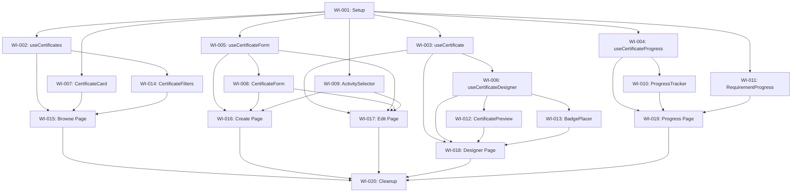

# VIBE-0007 Work Items Index: Certificates Refactor

## Overview

This document tracks the 20 work items for **VIBE-0007** (Certificates Pages Refactor - 2,333 lines across 5 files) following a **Test-Driven Development (TDD)** approach.

### Current State

| File | Lines | Complexity |
|------|-------|------------|
| `certificates/designer/page.tsx` | 858 | Very High |
| `certificates/[id]/edit/page.tsx` | 577 | High |
| `certificates/create/page.tsx` | 455 | Medium |
| `certificates/browse/page.tsx` | 428 | Medium |
| `my-certificates/[id]/progress/page.tsx` | 415 | Medium |

---

## Phase 1: Foundation Setup

| WI | Name | Status | File |
|----|------|--------|------|
| WI-001 | Setup Feature Module Structure | `[ ]` | [VIBE-0007-WI01-setup.md](./VIBE-0007-WI01-setup.md) |

## Phase 2: Hooks Development (TDD)

| WI | Name | Status | File |
|----|------|--------|------|
| WI-002 | useCertificates Hook | `[ ]` | [VIBE-0007-WI02-use-certificates.md](./VIBE-0007-WI02-use-certificates.md) |
| WI-003 | useCertificate Hook | `[ ]` | [VIBE-0007-WI03-use-certificate.md](./VIBE-0007-WI03-use-certificate.md) |
| WI-004 | useCertificateProgress Hook | `[ ]` | [VIBE-0007-WI04-use-certificate-progress.md](./VIBE-0007-WI04-use-certificate-progress.md) |
| WI-005 | useCertificateForm Hook | `[ ]` | [VIBE-0007-WI05-use-certificate-form.md](./VIBE-0007-WI05-use-certificate-form.md) |
| WI-006 | useCertificateDesigner Hook | `[ ]` | [VIBE-0007-WI06-use-certificate-designer.md](./VIBE-0007-WI06-use-certificate-designer.md) |

## Phase 3: Components Development (TDD)

| WI | Name | Status | File |
|----|------|--------|------|
| WI-007 | CertificateCard Component | `[ ]` | [VIBE-0007-WI07-certificate-card.md](./VIBE-0007-WI07-certificate-card.md) |
| WI-008 | CertificateForm Component | `[ ]` | [VIBE-0007-WI08-certificate-form.md](./VIBE-0007-WI08-certificate-form.md) |
| WI-009 | ActivitySelector Component | `[ ]` | [VIBE-0007-WI09-activity-selector.md](./VIBE-0007-WI09-activity-selector.md) |
| WI-010 | ProgressTracker Component | `[ ]` | [VIBE-0007-WI10-progress-tracker.md](./VIBE-0007-WI10-progress-tracker.md) |
| WI-011 | RequirementProgress Component | `[ ]` | [VIBE-0007-WI11-requirement-progress.md](./VIBE-0007-WI11-requirement-progress.md) |
| WI-012 | CertificatePreview Component | `[ ]` | [VIBE-0007-WI12-certificate-preview.md](./VIBE-0007-WI12-certificate-preview.md) |
| WI-013 | BadgePlacer Component | `[ ]` | [VIBE-0007-WI13-badge-placer.md](./VIBE-0007-WI13-badge-placer.md) |
| WI-014 | CertificateFilters Component | `[ ]` | [VIBE-0007-WI14-certificate-filters.md](./VIBE-0007-WI14-certificate-filters.md) |

## Phase 4: Page Integration

| WI | Name | Status | File |
|----|------|--------|------|
| WI-015 | Refactor Browse Page | `[ ]` | [VIBE-0007-WI15-browse-page.md](./VIBE-0007-WI15-browse-page.md) |
| WI-016 | Refactor Create Page | `[ ]` | [VIBE-0007-WI16-create-page.md](./VIBE-0007-WI16-create-page.md) |
| WI-017 | Refactor Edit Page | `[ ]` | [VIBE-0007-WI17-edit-page.md](./VIBE-0007-WI17-edit-page.md) |
| WI-018 | Refactor Designer Page | `[ ]` | [VIBE-0007-WI18-designer-page.md](./VIBE-0007-WI18-designer-page.md) |
| WI-019 | Refactor Progress Page | `[ ]` | [VIBE-0007-WI19-progress-page.md](./VIBE-0007-WI19-progress-page.md) |

## Phase 5: Cleanup & Documentation

| WI | Name | Status | File |
|----|------|--------|------|
| WI-020 | Final Cleanup and Documentation | `[ ]` | [VIBE-0007-WI20-cleanup.md](./VIBE-0007-WI20-cleanup.md) |

---

## Time Estimates

| Phase | Work Items | Estimated Time |
|-------|------------|----------------|
| 1. Foundation | WI-001 | 15 min |
| 2. Hooks (TDD) | WI-002 to WI-006 | 3.5 hours |
| 3. Components (TDD) | WI-007 to WI-014 | 4.5 hours |
| 4. Page Integration | WI-015 to WI-019 | 3.5 hours |
| 5. Cleanup | WI-020 | 30 min |
| **Total** | **20 Work Items** | **~12 hours** |

---

## Dependency Graph

## Notes for AI Agent

1. **TDD is mandatory** - Always write tests first before implementing hooks/components
2. **Run tests frequently** - After each implementation, verify tests pass with `npm run test`
3. **Small commits** - Commit after each work item completion
4. **Preserve behavior** - The refactor should not change any user-facing behavior
5. **Use existing patterns** - Follow the patterns established in `src/features/case-mode/`
6. **Type safety** - Ensure all TypeScript types are properly defined and used
