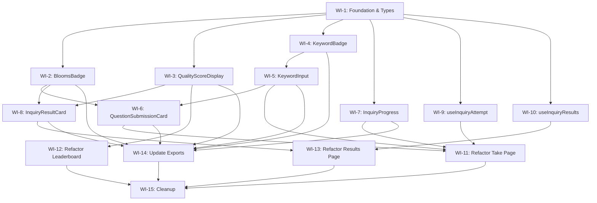

# VIBE-0009 Implementation Plan: Inquiry Mode Refactor

## Overview

This document breaks down VIBE-0009 (Inquiry Mode Refactor) into discrete work items for agentic AI implementation. The plan follows a **Test-Driven Development (TDD)** approach where unit tests are written first before implementation.

### Current State Analysis

| File | Lines | Complexity |
|------|-------|------------|
| `inquiry/take/inquiry-take-client.tsx` | 588 | High - question submission, evaluation polling, anti-cheat |
| `inquiry/leaderboard/page.tsx` | 502 | Medium - data fetching, filtering, ranking display |
| `inquiry/[attemptId]/results/page.tsx` | 389 | Medium - evaluation display, score visualization |
| **Total** | **1,479** | |

### Target State

```
src/features/inquiry-mode/
├── components/
│   ├── __tests__/                    # Component tests
│   │   ├── KeywordInput.test.tsx
│   │   ├── KeywordBadge.test.tsx
│   │   ├── QuestionSubmissionCard.test.tsx
│   │   ├── InquiryProgress.test.tsx
│   │   ├── InquiryResultCard.test.tsx
│   │   ├── QualityScoreDisplay.test.tsx
│   │   └── BloomsBadge.test.tsx
│   ├── KeywordInput.tsx              (~80 lines)
│   ├── KeywordBadge.tsx              (~50 lines)
│   ├── QuestionSubmissionCard.tsx    (~100 lines)
│   ├── InquiryProgress.tsx           (~60 lines)
│   ├── InquiryResultCard.tsx         (~100 lines)
│   ├── QualityScoreDisplay.tsx       (~60 lines)
│   ├── BloomsBadge.tsx               (~50 lines)
│   └── index.ts
├── hooks/
│   ├── __tests__/
│   │   ├── useInquiryAttempt.test.ts
│   │   └── useInquiryResults.test.ts
│   ├── useInquiryAttempt.ts          (~150 lines)
│   ├── useInquiryResults.ts          (~60 lines)
│   └── index.ts
├── types.ts                          (~80 lines)
└── index.ts
```

---

## Work Items

### Phase 1: Foundation & Types (Estimated: 1 hour)

---

#### WI-1: Create Feature Module Structure & Types

**Priority:** P0 (Blocking)  
**Estimated Size:** S  
**Dependencies:** None  

##### Description
Set up the `src/features/inquiry-mode/` directory structure and define TypeScript types based on the existing code analysis.

##### TDD Approach
1. **First:** Create types based on existing interfaces in the source files
2. **Then:** Create index files for module exports

##### Files to Create
1. `src/features/inquiry-mode/types.ts`
2. `src/features/inquiry-mode/index.ts`
3. `src/features/inquiry-mode/components/index.ts`
4. `src/features/inquiry-mode/hooks/index.ts`

##### Implementation Details

**types.ts** should include:
```typescript
// From inquiry-take-client.tsx (lines 11-30)
export interface SubmittedQuestion {
  id: string
  content: string
  score: number | null
  bloomsLevel: string | null
  feedback: string | null
  evaluationStatus?: 'pending' | 'evaluating' | 'completed' | 'error'
}

export interface InquiryAttemptData {
  activityId: string
  activityName: string
  attemptId: string
  questionsRequired: number
  timePerQuestion: number
  keywordPool1: string[]
  keywordPool2: string[]
  passThreshold: number
  submittedQuestions: SubmittedQuestion[]
}

// From leaderboard/page.tsx (lines 11-39)
export interface InquiryLeaderboardEntry {
  rank: number
  userId: string
  userName: string
  qualityScore: number
  qualityPercentage: number
  passed: boolean
  questionsGenerated: number
  questionsRequired: number
  avgBloomLevel: number
  timeTaken: string
  attemptNumber: number
  submittedAt: Date | null
  filterType: 'best' | 'recent' | 'both'
}

export interface InquiryLeaderboardStats {
  totalAttempts: number
  uniqueStudents: number
  averageScore: number
  passRate: number
}

export interface InquiryUserSummary {
  bestScore: number
  totalAttempts: number
  passRate: number
  rank: number
}

// From results/page.tsx (lines 10-30)
export interface InquiryEvaluationData {
  overallScore: number
  creativityScore: number | null
  clarityScore: number | null
  relevanceScore: number | null
  innovationScore: number | null
  complexityScore: number | null
  bloomsLevel: string | null
  evaluationText: string | null
  strengths: string[]
  improvements: string[]
  enhancedQuestions: Array<{ level: string; question: string }> | string[]
  nextLevelGuidance?: string
}

export interface QuestionWithEvaluation {
  id: string
  content: string
  createdAt: Date
  evaluation: InquiryEvaluationData | null
}
```

##### Acceptance Criteria
- [ ] `src/features/inquiry-mode/` directory exists
- [ ] All types are defined in `types.ts`
- [ ] All index.ts files export correctly
- [ ] Types compile without errors

---

### Phase 2: UI Components with Tests (Estimated: 3 hours)

---

#### WI-2: Create BloomsBadge Component (TDD)

**Priority:** P1  
**Estimated Size:** S  
**Dependencies:** WI-1  

##### Description
Extract Bloom's Taxonomy level badge display logic that's duplicated across inquiry pages.

##### TDD Approach

**Step 1: Write Tests First**

Create `src/features/inquiry-mode/components/__tests__/BloomsBadge.test.tsx`:
```typescript
import { render, screen } from '@testing-library/react'
import { BloomsBadge } from '../BloomsBadge'

describe('BloomsBadge', () => {
  it('renders the correct Korean label for each level', () => {
    const levels = [
      { input: 'remember', expected: '기억' },
      { input: 'understand', expected: '이해' },
      { input: 'apply', expected: '적용' },
      { input: 'analyze', expected: '분석' },
      { input: 'evaluate', expected: '평가' },
      { input: 'create', expected: '창조' },
    ]
    
    levels.forEach(({ input, expected }) => {
      const { unmount } = render(<BloomsBadge level={input} />)
      expect(screen.getByText(expected)).toBeInTheDocument()
      unmount()
    })
  })

  it('applies correct color classes for each level', () => {
    // Test color mapping
  })

  it('handles null level gracefully', () => {
    render(<BloomsBadge level={null} />)
    expect(screen.getByText('평가중')).toBeInTheDocument()
  })

  it('shows description when showDescription prop is true', () => {
    render(<BloomsBadge level="analyze" showDescription />)
    expect(screen.getByText(/문제를 분석/)).toBeInTheDocument()
  })
})
```

**Step 2: Implement Component**

Extract from `inquiry-take-client.tsx` (lines 175-209):
- `getBloomsBadgeColor()`
- `getBloomsKorean()`
- `getBloomsDescription()`

##### Files
- `src/features/inquiry-mode/components/__tests__/BloomsBadge.test.tsx`
- `src/features/inquiry-mode/components/BloomsBadge.tsx`

##### Acceptance Criteria
- [ ] All tests pass
- [ ] Component is under 50 lines
- [ ] Exported from index.ts

---

#### WI-3: Create QualityScoreDisplay Component (TDD)

**Priority:** P1  
**Estimated Size:** S  
**Dependencies:** WI-1  

##### Description
Extract score display and color logic used in results and leaderboard pages.

##### TDD Approach

**Step 1: Write Tests First**

Create `src/features/inquiry-mode/components/__tests__/QualityScoreDisplay.test.tsx`:
```typescript
import { render, screen } from '@testing-library/react'
import { QualityScoreDisplay, getScoreColor, getScoreBgColor } from '../QualityScoreDisplay'

describe('QualityScoreDisplay', () => {
  describe('getScoreColor', () => {
    it('returns emerald for scores >= 80', () => {
      expect(getScoreColor(80)).toBe('text-emerald-600')
      expect(getScoreColor(100)).toBe('text-emerald-600')
    })

    it('returns amber for scores >= 60', () => {
      expect(getScoreColor(60)).toBe('text-amber-600')
      expect(getScoreColor(79)).toBe('text-amber-600')
    })

    it('returns red for scores < 60', () => {
      expect(getScoreColor(59)).toBe('text-red-600')
      expect(getScoreColor(0)).toBe('text-red-600')
    })
  })

  it('renders score with percentage', () => {
    render(<QualityScoreDisplay score={85} />)
    expect(screen.getByText('85%')).toBeInTheDocument()
  })

  it('renders with pass/fail indicator when showPassStatus is true', () => {
    render(<QualityScoreDisplay score={85} passThreshold={70} showPassStatus />)
    expect(screen.getByText(/통과/)).toBeInTheDocument()
  })
})
```

**Step 2: Implement Component**

Extract from `results/page.tsx` (lines 129-139):
- `getScoreColor()`
- `getScoreBgColor()`

##### Files
- `src/features/inquiry-mode/components/__tests__/QualityScoreDisplay.test.tsx`
- `src/features/inquiry-mode/components/QualityScoreDisplay.tsx`

##### Acceptance Criteria
- [ ] All tests pass
- [ ] Component is under 60 lines
- [ ] Exported from index.ts

---

#### WI-4: Create KeywordBadge Component (TDD)

**Priority:** P1  
**Estimated Size:** S  
**Dependencies:** WI-1  

##### Description
Create a reusable component for displaying and removing keywords in the inquiry take experience.

##### TDD Approach

**Step 1: Write Tests First**

Create `src/features/inquiry-mode/components/__tests__/KeywordBadge.test.tsx`:
```typescript
import { render, screen, fireEvent } from '@testing-library/react'
import { KeywordBadge } from '../KeywordBadge'

describe('KeywordBadge', () => {
  it('renders the keyword text', () => {
    render(<KeywordBadge keyword="innovation" onRemove={jest.fn()} />)
    expect(screen.getByText('innovation')).toBeInTheDocument()
  })

  it('calls onRemove when X button is clicked', () => {
    const mockOnRemove = jest.fn()
    render(<KeywordBadge keyword="test" onRemove={mockOnRemove} />)
    
    fireEvent.click(screen.getByRole('button'))
    expect(mockOnRemove).toHaveBeenCalledTimes(1)
  })

  it('shows highlighted style when isHighlighted is true', () => {
    render(<KeywordBadge keyword="test" isHighlighted onRemove={jest.fn()} />)
    expect(screen.getByTestId('keyword-badge')).toHaveClass('bg-blue-100')
  })

  it('disables remove button when disabled prop is true', () => {
    render(<KeywordBadge keyword="test" disabled onRemove={jest.fn()} />)
    expect(screen.getByRole('button')).toBeDisabled()
  })
})
```

**Step 2: Implement Component**

##### Files
- `src/features/inquiry-mode/components/__tests__/KeywordBadge.test.tsx`
- `src/features/inquiry-mode/components/KeywordBadge.tsx`

##### Acceptance Criteria
- [ ] All tests pass
- [ ] Component is under 50 lines
- [ ] Exported from index.ts

---

#### WI-5: Create KeywordInput Component (TDD)

**Priority:** P1  
**Estimated Size:** M  
**Dependencies:** WI-4  

##### Description
Create the main keyword input component that uses KeywordBadge for displaying entered keywords.

##### TDD Approach

**Step 1: Write Tests First**

Create `src/features/inquiry-mode/components/__tests__/KeywordInput.test.tsx`:
```typescript
import { render, screen, fireEvent } from '@testing-library/react'
import userEvent from '@testing-library/user-event'
import { KeywordInput } from '../KeywordInput'

describe('KeywordInput', () => {
  const defaultProps = {
    keywords: [],
    onAdd: jest.fn(),
    onRemove: jest.fn(),
  }

  beforeEach(() => {
    jest.clearAllMocks()
  })

  it('renders input field and add button', () => {
    render(<KeywordInput {...defaultProps} />)
    expect(screen.getByPlaceholderText(/키워드/)).toBeInTheDocument()
    expect(screen.getByRole('button', { name: /추가/ })).toBeInTheDocument()
  })

  it('calls onAdd when Enter is pressed with valid input', async () => {
    render(<KeywordInput {...defaultProps} />)
    
    const input = screen.getByPlaceholderText(/키워드/)
    await userEvent.type(input, 'innovation{Enter}')
    
    expect(defaultProps.onAdd).toHaveBeenCalledWith('innovation')
  })

  it('calls onAdd when Add button is clicked', async () => {
    render(<KeywordInput {...defaultProps} />)
    
    const input = screen.getByPlaceholderText(/키워드/)
    await userEvent.type(input, 'creativity')
    await userEvent.click(screen.getByRole('button', { name: /추가/ }))
    
    expect(defaultProps.onAdd).toHaveBeenCalledWith('creativity')
  })

  it('does not add empty keyword', async () => {
    render(<KeywordInput {...defaultProps} />)
    
    await userEvent.click(screen.getByRole('button', { name: /추가/ }))
    expect(defaultProps.onAdd).not.toHaveBeenCalled()
  })

  it('shows keyword count', () => {
    render(<KeywordInput {...defaultProps} keywords={['a', 'b', 'c']} maxKeywords={10} />)
    expect(screen.getByText('3/10')).toBeInTheDocument()
  })

  it('disables add when max keywords reached', () => {
    render(<KeywordInput {...defaultProps} keywords={['a', 'b']} maxKeywords={2} />)
    expect(screen.getByRole('button', { name: /추가/ })).toBeDisabled()
  })

  it('renders keyword badges for each keyword', () => {
    render(<KeywordInput {...defaultProps} keywords={['foo', 'bar']} />)
    expect(screen.getByText('foo')).toBeInTheDocument()
    expect(screen.getByText('bar')).toBeInTheDocument()
  })

  it('calls onRemove with correct index when badge is removed', async () => {
    render(<KeywordInput {...defaultProps} keywords={['a', 'b', 'c']} />)
    
    const removeButtons = screen.getAllByRole('button', { name: /제거/ })
    await userEvent.click(removeButtons[1])
    
    expect(defaultProps.onRemove).toHaveBeenCalledWith(1)
  })

  it('shows keyword pool hints when provided', () => {
    render(
      <KeywordInput 
        {...defaultProps} 
        keywordPool1={['hint1', 'hint2']}
        keywordPool2={['hint3', 'hint4']}
      />
    )
    expect(screen.getByText(/hint1/)).toBeInTheDocument()
  })
})
```

**Step 2: Implement Component**

##### Files
- `src/features/inquiry-mode/components/__tests__/KeywordInput.test.tsx`
- `src/features/inquiry-mode/components/KeywordInput.tsx`

##### Acceptance Criteria
- [ ] All tests pass
- [ ] Component is under 80 lines
- [ ] Exported from index.ts

---

#### WI-6: Create QuestionSubmissionCard Component (TDD)

**Priority:** P1  
**Estimated Size:** M  
**Dependencies:** WI-5, WI-2  

##### Description
Create a card component that displays a submitted question with its evaluation status and Bloom's level.

##### TDD Approach

**Step 1: Write Tests First**

Create `src/features/inquiry-mode/components/__tests__/QuestionSubmissionCard.test.tsx`:
```typescript
import { render, screen } from '@testing-library/react'
import { QuestionSubmissionCard } from '../QuestionSubmissionCard'
import type { SubmittedQuestion } from '../../types'

describe('QuestionSubmissionCard', () => {
  const mockQuestion: SubmittedQuestion = {
    id: '1',
    content: 'What is the impact of AI on education?',
    score: 85,
    bloomsLevel: 'analyze',
    feedback: 'Great analytical question!',
    evaluationStatus: 'completed',
  }

  it('renders question content', () => {
    render(<QuestionSubmissionCard question={mockQuestion} index={0} />)
    expect(screen.getByText(/What is the impact/)).toBeInTheDocument()
  })

  it('shows question number', () => {
    render(<QuestionSubmissionCard question={mockQuestion} index={2} />)
    expect(screen.getByText('질문 3')).toBeInTheDocument()
  })

  it('displays score when completed', () => {
    render(<QuestionSubmissionCard question={mockQuestion} index={0} />)
    expect(screen.getByText('85')).toBeInTheDocument()
  })

  it('shows loading spinner when evaluating', () => {
    const evaluating = { ...mockQuestion, evaluationStatus: 'evaluating' as const }
    render(<QuestionSubmissionCard question={evaluating} index={0} />)
    expect(screen.getByTestId('loading-spinner')).toBeInTheDocument()
  })

  it('shows pending status when pending', () => {
    const pending = { ...mockQuestion, evaluationStatus: 'pending' as const, score: null }
    render(<QuestionSubmissionCard question={pending} index={0} />)
    expect(screen.getByText(/대기/)).toBeInTheDocument()
  })

  it('displays Blooms badge when level is available', () => {
    render(<QuestionSubmissionCard question={mockQuestion} index={0} />)
    expect(screen.getByText('분석')).toBeInTheDocument()
  })
})
```

**Step 2: Implement Component**

##### Files
- `src/features/inquiry-mode/components/__tests__/QuestionSubmissionCard.test.tsx`
- `src/features/inquiry-mode/components/QuestionSubmissionCard.tsx`

##### Acceptance Criteria
- [ ] All tests pass
- [ ] Component is under 100 lines
- [ ] Uses BloomsBadge component
- [ ] Exported from index.ts

---

#### WI-7: Create InquiryProgress Component (TDD)

**Priority:** P1  
**Estimated Size:** S  
**Dependencies:** WI-1  

##### Description
Create a progress indicator showing current question count vs required count.

##### TDD Approach

**Step 1: Write Tests First**

Create `src/features/inquiry-mode/components/__tests__/InquiryProgress.test.tsx`:
```typescript
import { render, screen } from '@testing-library/react'
import { InquiryProgress } from '../InquiryProgress'

describe('InquiryProgress', () => {
  it('renders current and total count', () => {
    render(<InquiryProgress current={3} total={5} />)
    expect(screen.getByText('3 / 5')).toBeInTheDocument()
  })

  it('shows progress bar with correct width', () => {
    render(<InquiryProgress current={2} total={4} />)
    const progressBar = screen.getByTestId('progress-bar')
    expect(progressBar).toHaveStyle({ width: '50%' })
  })

  it('shows completion state when current equals total', () => {
    render(<InquiryProgress current={5} total={5} />)
    expect(screen.getByText(/완료/)).toBeInTheDocument()
  })

  it('renders label when provided', () => {
    render(<InquiryProgress current={1} total={3} label="질문 생성" />)
    expect(screen.getByText('질문 생성')).toBeInTheDocument()
  })
})
```

**Step 2: Implement Component**

##### Files
- `src/features/inquiry-mode/components/__tests__/InquiryProgress.test.tsx`
- `src/features/inquiry-mode/components/InquiryProgress.tsx`

##### Acceptance Criteria
- [ ] All tests pass
- [ ] Component is under 60 lines
- [ ] Exported from index.ts

---

#### WI-8: Create InquiryResultCard Component (TDD)

**Priority:** P1  
**Estimated Size:** M  
**Dependencies:** WI-2, WI-3  

##### Description
Create a results card for displaying individual question evaluations with scores and feedback.

##### TDD Approach

**Step 1: Write Tests First**

Create `src/features/inquiry-mode/components/__tests__/InquiryResultCard.test.tsx`:
```typescript
import { render, screen, fireEvent } from '@testing-library/react'
import { InquiryResultCard } from '../InquiryResultCard'
import type { QuestionWithEvaluation } from '../../types'

describe('InquiryResultCard', () => {
  const mockQuestion: QuestionWithEvaluation = {
    id: '1',
    content: 'How does machine learning impact education?',
    createdAt: new Date('2026-01-20'),
    evaluation: {
      overallScore: 85,
      creativityScore: 80,
      clarityScore: 90,
      relevanceScore: 85,
      innovationScore: 75,
      complexityScore: 88,
      bloomsLevel: 'analyze',
      evaluationText: 'Excellent analytical question',
      strengths: ['Clear wording', 'Relevant topic'],
      improvements: ['Add specific context'],
      enhancedQuestions: [
        { level: 'evaluate', question: 'Evaluate the effectiveness of ML in education' }
      ],
    },
  }

  it('renders question content', () => {
    render(<InquiryResultCard question={mockQuestion} index={0} />)
    expect(screen.getByText(/machine learning/)).toBeInTheDocument()
  })

  it('displays overall score', () => {
    render(<InquiryResultCard question={mockQuestion} index={0} />)
    expect(screen.getByText('85')).toBeInTheDocument()
  })

  it('shows breakdown scores when expanded', () => {
    render(<InquiryResultCard question={mockQuestion} index={0} />)
    
    fireEvent.click(screen.getByRole('button', { name: /상세/ }))
    
    expect(screen.getByText(/창의성: 80/)).toBeInTheDocument()
    expect(screen.getByText(/명확성: 90/)).toBeInTheDocument()
  })

  it('displays strengths and improvements', () => {
    render(<InquiryResultCard question={mockQuestion} index={0} expanded />)
    
    expect(screen.getByText('Clear wording')).toBeInTheDocument()
    expect(screen.getByText('Add specific context')).toBeInTheDocument()
  })

  it('shows enhanced questions', () => {
    render(<InquiryResultCard question={mockQuestion} index={0} expanded />)
    
    expect(screen.getByText(/Evaluate the effectiveness/)).toBeInTheDocument()
  })

  it('handles missing evaluation gracefully', () => {
    const noEval = { ...mockQuestion, evaluation: null }
    render(<InquiryResultCard question={noEval} index={0} />)
    expect(screen.getByText(/평가 대기/)).toBeInTheDocument()
  })
})
```

**Step 2: Implement Component**

##### Files
- `src/features/inquiry-mode/components/__tests__/InquiryResultCard.test.tsx`
- `src/features/inquiry-mode/components/InquiryResultCard.tsx`

##### Acceptance Criteria
- [ ] All tests pass
- [ ] Component is under 100 lines
- [ ] Uses BloomsBadge and QualityScoreDisplay
- [ ] Exported from index.ts

---

### Phase 3: Custom Hooks with Tests (Estimated: 2 hours)

---

#### WI-9: Create useInquiryAttempt Hook (TDD)

**Priority:** P0  
**Estimated Size:** L  
**Dependencies:** WI-1  

##### Description
Extract the main inquiry attempt logic from `inquiry-take-client.tsx` into a reusable hook.

##### TDD Approach

**Step 1: Write Tests First**

Create `src/features/inquiry-mode/hooks/__tests__/useInquiryAttempt.test.ts`:
```typescript
import { renderHook, act, waitFor } from '@testing-library/react'
import { useInquiryAttempt } from '../useInquiryAttempt'

// Mock the server actions
jest.mock('@/app/(dashboard)/activities/[id]/inquiry/actions', () => ({
  submitInquiryQuestion: jest.fn(),
  completeInquiryAttempt: jest.fn(),
  updateInquiryCheatingStats: jest.fn(),
}))

describe('useInquiryAttempt', () => {
  const mockInitialData = {
    activityId: 'activity-1',
    activityName: 'Test Activity',
    attemptId: 'attempt-1',
    questionsRequired: 3,
    timePerQuestion: 120,
    keywordPool1: ['keyword1', 'keyword2'],
    keywordPool2: ['keyword3', 'keyword4'],
    passThreshold: 70,
    submittedQuestions: [],
  }

  beforeEach(() => {
    jest.clearAllMocks()
  })

  describe('initialization', () => {
    it('initializes with provided data', () => {
      const { result } = renderHook(() => useInquiryAttempt(mockInitialData))
      
      expect(result.current.attemptId).toBe('attempt-1')
      expect(result.current.questionsRequired).toBe(3)
      expect(result.current.submittedQuestions).toHaveLength(0)
    })

    it('initializes with existing submitted questions', () => {
      const withQuestions = {
        ...mockInitialData,
        submittedQuestions: [
          { id: '1', content: 'Test?', score: 80, bloomsLevel: 'apply', feedback: null, evaluationStatus: 'completed' as const }
        ],
      }
      
      const { result } = renderHook(() => useInquiryAttempt(withQuestions))
      expect(result.current.submittedQuestions).toHaveLength(1)
    })
  })

  describe('question submission', () => {
    it('validates question content is not empty', async () => {
      const { result } = renderHook(() => useInquiryAttempt(mockInitialData))
      
      await act(async () => {
        await result.current.submitQuestion('')
      })
      
      expect(result.current.error).toBe('질문 내용을 입력해주세요')
    })

    it('adds pending question on submit', async () => {
      const { submitInquiryQuestion } = require('@/app/(dashboard)/activities/[id]/inquiry/actions')
      submitInquiryQuestion.mockResolvedValue({
        success: true,
        question: { id: 'q-1', content: 'Test?', score: null, bloomsLevel: null, feedback: null }
      })
      
      const { result } = renderHook(() => useInquiryAttempt(mockInitialData))
      
      await act(async () => {
        await result.current.submitQuestion('What is the impact?')
      })
      
      expect(result.current.submittedQuestions).toHaveLength(1)
      expect(result.current.submittedQuestions[0].evaluationStatus).toBe('evaluating')
    })

    it('prevents submission when questionsRequired is met', () => {
      const fullData = {
        ...mockInitialData,
        submittedQuestions: Array(3).fill(null).map((_, i) => ({
          id: `q-${i}`,
          content: 'Q?',
          score: 80,
          bloomsLevel: 'apply',
          feedback: null,
          evaluationStatus: 'completed' as const,
        })),
      }
      
      const { result } = renderHook(() => useInquiryAttempt(fullData))
      expect(result.current.canSubmitMore).toBe(false)
    })
  })

  describe('completion', () => {
    it('returns hasCompletedRequired when all questions submitted', () => {
      const fullData = {
        ...mockInitialData,
        questionsRequired: 2,
        submittedQuestions: [
          { id: '1', content: 'Q1?', score: 80, bloomsLevel: 'apply', evaluationStatus: 'completed' as const },
          { id: '2', content: 'Q2?', score: 85, bloomsLevel: 'analyze', evaluationStatus: 'completed' as const },
        ],
      }
      
      const { result } = renderHook(() => useInquiryAttempt(fullData))
      expect(result.current.hasCompletedRequired).toBe(true)
    })

    it('calculates average score correctly', () => {
      const data = {
        ...mockInitialData,
        submittedQuestions: [
          { id: '1', content: 'Q1?', score: 80, bloomsLevel: null, evaluationStatus: 'completed' as const },
          { id: '2', content: 'Q2?', score: 90, bloomsLevel: null, evaluationStatus: 'completed' as const },
        ],
      }
      
      const { result } = renderHook(() => useInquiryAttempt(data))
      expect(result.current.averageScore).toBe(85)
    })
  })

  describe('timer integration', () => {
    it('provides timeRemaining state', () => {
      const { result } = renderHook(() => useInquiryAttempt(mockInitialData))
      expect(result.current.timeRemaining).toBeDefined()
    })
  })
})
```

**Step 2: Implement Hook**

Extract from `inquiry-take-client.tsx`:
- State management (lines 42-70)
- `handleSubmitQuestion` (lines 105-151)
- `handleComplete` (lines 153-166)
- Timer logic

##### Files
- `src/features/inquiry-mode/hooks/__tests__/useInquiryAttempt.test.ts`
- `src/features/inquiry-mode/hooks/useInquiryAttempt.ts`

##### Acceptance Criteria
- [ ] All tests pass
- [ ] Hook is under 150 lines
- [ ] Exported from index.ts
- [ ] Integrates with existing server actions

---

#### WI-10: Create useInquiryResults Hook (TDD)

**Priority:** P1  
**Estimated Size:** S  
**Dependencies:** WI-1  

##### Description
Create a hook to manage results data fetching and computed values for the results page.

##### TDD Approach

**Step 1: Write Tests First**

Create `src/features/inquiry-mode/hooks/__tests__/useInquiryResults.test.ts`:
```typescript
import { renderHook } from '@testing-library/react'
import { useInquiryResults } from '../useInquiryResults'
import type { QuestionWithEvaluation } from '../../types'

describe('useInquiryResults', () => {
  const mockQuestions: QuestionWithEvaluation[] = [
    {
      id: '1',
      content: 'Question 1?',
      createdAt: new Date(),
      evaluation: {
        overallScore: 80,
        bloomsLevel: 'analyze',
        creativityScore: 75,
        clarityScore: 85,
        relevanceScore: 80,
        innovationScore: 78,
        complexityScore: 82,
        evaluationText: 'Good question',
        strengths: ['Clear'],
        improvements: ['Add depth'],
        enhancedQuestions: [],
      },
    },
    {
      id: '2',
      content: 'Question 2?',
      createdAt: new Date(),
      evaluation: {
        overallScore: 90,
        bloomsLevel: 'evaluate',
        creativityScore: 88,
        clarityScore: 92,
        relevanceScore: 90,
        innovationScore: 85,
        complexityScore: 93,
        evaluationText: 'Excellent',
        strengths: ['Insightful'],
        improvements: [],
        enhancedQuestions: [],
      },
    },
  ]

  it('calculates total score correctly', () => {
    const { result } = renderHook(() => useInquiryResults({ questions: mockQuestions, passThreshold: 70 }))
    expect(result.current.totalScore).toBe(85)
  })

  it('determines pass/fail status', () => {
    const { result } = renderHook(() => useInquiryResults({ questions: mockQuestions, passThreshold: 70 }))
    expect(result.current.passed).toBe(true)
  })

  it('returns highest bloom level', () => {
    const { result } = renderHook(() => useInquiryResults({ questions: mockQuestions, passThreshold: 70 }))
    expect(result.current.highestBloomLevel).toBe('evaluate')
  })

  it('groups questions by bloom level', () => {
    const { result } = renderHook(() => useInquiryResults({ questions: mockQuestions, passThreshold: 70 }))
    expect(result.current.questionsByBloomLevel['analyze']).toHaveLength(1)
    expect(result.current.questionsByBloomLevel['evaluate']).toHaveLength(1)
  })

  it('handles empty questions array', () => {
    const { result } = renderHook(() => useInquiryResults({ questions: [], passThreshold: 70 }))
    expect(result.current.totalScore).toBe(0)
    expect(result.current.passed).toBe(false)
  })
})
```

**Step 2: Implement Hook**

##### Files
- `src/features/inquiry-mode/hooks/__tests__/useInquiryResults.test.ts`
- `src/features/inquiry-mode/hooks/useInquiryResults.ts`

##### Acceptance Criteria
- [ ] All tests pass
- [ ] Hook is under 60 lines
- [ ] Exported from index.ts

---

### Phase 4: Page Refactoring (Estimated: 2 hours)

---

#### WI-11: Refactor Inquiry Take Page

**Priority:** P0  
**Estimated Size:** L  
**Dependencies:** WI-5, WI-6, WI-7, WI-9  

##### Description
Refactor `inquiry/take/inquiry-take-client.tsx` to use the extracted hooks and components.

##### Implementation Steps

1. Import new components and hooks:
   ```typescript
   import { useInquiryAttempt } from '@/features/inquiry-mode/hooks'
   import { 
     KeywordInput,
     QuestionSubmissionCard,
     InquiryProgress,
     BloomsBadge 
   } from '@/features/inquiry-mode/components'
   import { ExamTimer } from '@/components/modes/ExamTimer' // Shared
   ```

2. Replace state management with `useInquiryAttempt` hook

3. Replace inline components with extracted versions

4. Keep anti-cheat integration (`useAntiCheat` hook)

##### Target
- Page should be under 120 lines
- All internal component/logic definitions removed
- Only composition and page-specific layout remain

##### Files to Modify
- `src/app/(dashboard)/activities/[id]/inquiry/take/inquiry-take-client.tsx`

##### Acceptance Criteria
- [ ] Page is under 120 lines
- [ ] All existing functionality preserved
- [ ] Uses extracted hooks and components
- [ ] Anti-cheat functionality works

---

#### WI-12: Refactor Inquiry Leaderboard Page

**Priority:** P1  
**Estimated Size:** M  
**Dependencies:** WI-3  

##### Description
Refactor `inquiry/leaderboard/page.tsx` to reuse shared leaderboard components from case-mode.

##### Analysis
The leaderboard pattern is shared across modes. Reference `src/features/case-mode/components/`:
- `StatCard.tsx` - can be reused directly
- `LeaderboardRow.tsx` - may need inquiry-specific variant
- `UserPerformanceCard.tsx` - can be reused with different data

##### Implementation Steps

1. Identify shared vs inquiry-specific logic

2. Create `src/features/shared/` directory if not exists

3. Move shared leaderboard components to shared:
   - `StatCard` (already generic)
   - Base `LeaderboardRow` with mode-specific variants

4. Refactor page to use shared components

5. Extract inquiry-specific display components

##### Files
- `src/app/(dashboard)/activities/[id]/inquiry/leaderboard/page.tsx`
- `src/features/shared/components/` (new shared components)

##### Acceptance Criteria
- [ ] Page is under 150 lines
- [ ] Reuses shared leaderboard components
- [ ] Filtering logic preserved
- [ ] All existing functionality works

---

#### WI-13: Refactor Inquiry Results Page

**Priority:** P1  
**Estimated Size:** M  
**Dependencies:** WI-8, WI-10  

##### Description
Refactor `inquiry/[attemptId]/results/page.tsx` to use extracted components and hooks.

##### Implementation Steps

1. Import new components and hooks:
   ```typescript
   import { useInquiryResults } from '@/features/inquiry-mode/hooks'
   import { 
     InquiryResultCard,
     QualityScoreDisplay,
     BloomsBadge 
   } from '@/features/inquiry-mode/components'
   ```

2. Move inline helper functions to components:
   - `getScoreColor` → `QualityScoreDisplay`
   - `getBloomsBadgeColor` → `BloomsBadge`

3. Replace inline rendering with composed components

##### Files to Modify
- `src/app/(dashboard)/activities/[id]/inquiry/[attemptId]/results/page.tsx`

##### Acceptance Criteria
- [ ] Page is under 100 lines
- [ ] Uses extracted hooks and components
- [ ] All existing functionality preserved

---

### Phase 5: Integration & Cleanup (Estimated: 1 hour)

---

#### WI-14: Update Component Index Exports

**Priority:** P1  
**Estimated Size:** S  
**Dependencies:** WI-2 through WI-8  

##### Description
Ensure all components are properly exported from the index files.

##### Files
- `src/features/inquiry-mode/components/index.ts`
- `src/features/inquiry-mode/hooks/index.ts`
- `src/features/inquiry-mode/index.ts`

##### Expected content for `components/index.ts`:
```typescript
// Inquiry Mode Components

// Display Components
export { BloomsBadge } from './BloomsBadge'
export { QualityScoreDisplay, getScoreColor, getScoreBgColor } from './QualityScoreDisplay'

// Input Components  
export { KeywordBadge } from './KeywordBadge'
export { KeywordInput } from './KeywordInput'

// Card Components
export { QuestionSubmissionCard } from './QuestionSubmissionCard'
export { InquiryResultCard } from './InquiryResultCard'

// Progress Components
export { InquiryProgress } from './InquiryProgress'
```

##### Acceptance Criteria
- [ ] All exports compile without errors
- [ ] Types are properly exported

---

#### WI-15: Remove Dead Code & Final Cleanup

**Priority:** P2  
**Estimated Size:** S  
**Dependencies:** WI-11, WI-12, WI-13  

##### Description
Remove any remaining dead code from the original files and ensure no duplicate logic exists.

##### Checklist
- [ ] Remove unused imports from refactored pages
- [ ] Delete any commented-out code blocks
- [ ] Verify no duplicate utility functions exist
- [ ] Run linter and fix any issues
- [ ] Run all tests to verify nothing is broken

##### Acceptance Criteria
- [ ] No TypeScript errors
- [ ] All tests pass
- [ ] Linter passes
- [ ] Total lines in pages meet targets:
  - Take page: < 120 lines
  - Leaderboard: < 150 lines  
  - Results: < 100 lines

---

## Work Item Dependency Graph



---

## Execution Order for Agentic AI

### Recommended Parallel Execution Groups

**Group 1** (Can run in parallel after WI-1):
- WI-2: BloomsBadge
- WI-3: QualityScoreDisplay
- WI-4: KeywordBadge
- WI-7: InquiryProgress

**Group 2** (Can run in parallel after Group 1):
- WI-5: KeywordInput (after WI-4)
- WI-9: useInquiryAttempt
- WI-10: useInquiryResults

**Group 3** (After Group 2):
- WI-6: QuestionSubmissionCard
- WI-8: InquiryResultCard

**Group 4** (Page refactors - sequential recommended):
- WI-11: Take Page
- WI-12: Leaderboard
- WI-13: Results Page

**Group 5** (Finalization):
- WI-14: Exports
- WI-15: Cleanup

---

## Testing Commands

```bash
# Run specific test file
npm test -- src/features/inquiry-mode/components/__tests__/BloomsBadge.test.tsx

# Run all inquiry-mode tests
npm test -- src/features/inquiry-mode

# Run with coverage
npm test -- --coverage src/features/inquiry-mode

# Run in watch mode during development
npm test -- --watch src/features/inquiry-mode
```

---

## Success Metrics

| Metric | Before | Target |
|--------|--------|--------|
| Total Lines | 1,479 | ~650 |
| Take Page Lines | 588 | <120 |
| Leaderboard Lines | 502 | <150 |
| Results Page Lines | 389 | <100 |
| Test Coverage | 0% | >80% |
| Reusable Components | 0 | 7 |
| Custom Hooks | 0 | 2 |

---

## Notes for AI Agent

1. **Always run tests first** - Follow TDD strictly. Write failing tests, then implement.

2. **Check for shared components** - Before creating new components, check if similar exist in:
   - `src/features/case-mode/components/`
   - `src/components/modes/`

3. **Preserve anti-cheat** - The `useAntiCheat` hook integration must be preserved in the take page.

4. **Server actions** - Don't modify `actions.ts` unless necessary. Hook should integrate with existing server actions.

5. **Timer integration** - The timer component is shared with Exam/Case modes. Use `ExamTimer` from `@/components/modes/`.

6. **Korean localization** - Preserve all Korean language strings (labels, messages, etc.).
