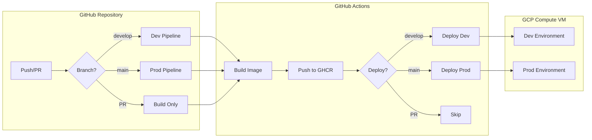
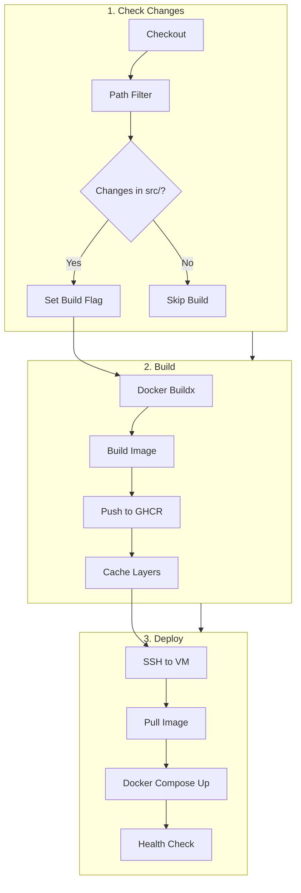
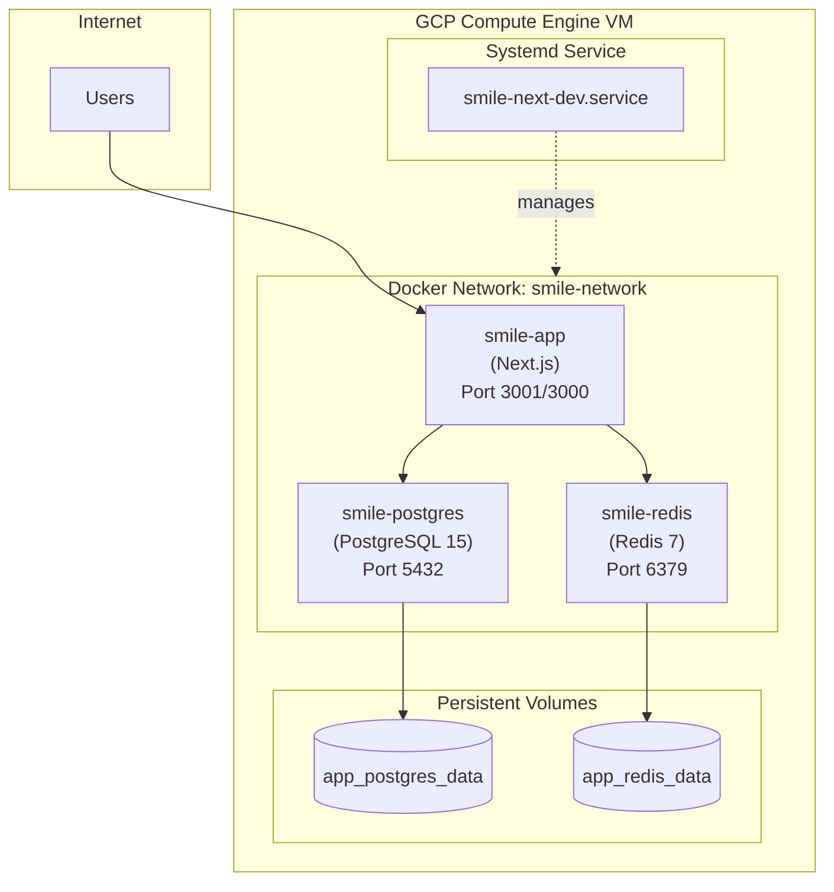

# CI/CD and Deployment Guide

## Overview

This document provides an overview of the CI/CD pipeline and deployment infrastructure for the SMILE Next.js application. The system uses GitHub Actions for automation and Docker Compose for container orchestration.

### Environment Status

| Environment | Status | Branch | Port | Infrastructure |
|-------------|--------|--------|------|----------------|
| **Dev** | ✅ Working | `develop` | 3001 | GCP Compute VM + Docker Postgres/Redis |
| **Prod** | 🚧 In Progress | `main` | 3000 | GCP Compute VM + Cloud SQL (planned) |

---

## Documentation Structure

This guide is split into multiple documents for easier maintenance:

| Document | Description |
|----------|-------------|
| [GitHub Actions](./github-actions.md) | Workflow configuration and pipeline details |
| [Docker Configuration](./docker-configuration.md) | Docker Compose and Dockerfile setup |
| [VM Setup](./vm-setup.md) | First-time setup and environment configuration |
| [Troubleshooting](./deployment-troubleshooting.md) | Common issues and solutions |

---

## Architecture Overview

### High-Level Pipeline Flow



### CI/CD Pipeline Stages



### Deployment Architecture



---

## Quick Start

### For Existing Deployments

```bash
# SSH into VM
ssh user@vm-host

# Navigate to project
cd ~/smile-next

# Check status
docker compose -f docker-compose.dev.yml ps

# View logs
docker compose -f docker-compose.dev.yml logs -f app

# Health check
curl http://localhost:3001/api/health
```

### For New Deployments

See [VM Setup Guide](./vm-setup.md) for complete first-time setup instructions.

---

## Key Configuration Files

### Repository Files

```
.
├── .github/workflows/
│   ├── ci-cd.yml                    # Main orchestration workflow
│   ├── build-node.yml               # Reusable build workflow
│   ├── deploy-gcp-compute-vm-ssh.yml # Reusable deploy workflow
│   └── setup-vm.yml                 # Infrastructure provisioning
├── docker-compose.yml               # Local development
├── docker-compose.dev.yml           # Dev VM deployment
├── docker-compose.prod.yml          # Production deployment
├── Dockerfile                       # Multi-stage build
└── scripts/deploy/
    ├── update-app.sh                # Main deployment script
    ├── verify-deployment.sh         # Health verification
    ├── validate-env.sh              # Environment validation
    └── setup-systemd-service.sh     # Systemd setup
```

### VM Files

```
~/smile-next/
├── .env                             # Environment variables (manual)
├── docker-compose.dev.yml           # Copied by CI/CD
├── docker-compose.prod.yml          # Copied by CI/CD
└── scripts/deploy/                  # Copied by CI/CD
```

---

## Required GitHub Secrets

| Secret | Description | Required For | Default |
|--------|-------------|--------------|---------|
| `GHCR_PAT` | GitHub Container Registry PAT | Build, Deploy | - |
| `GHCR_USERNAME` | GitHub username | Build, Deploy | - |
| `VM_HOST` | GCP VM IP or hostname | Deploy | - |
| `VM_USERNAME` | SSH username | Deploy | - |
| `SSH_PRIVATE_KEY` | SSH private key | Deploy | - |
| `VM_PORT_MAIN` | Port for main/production | Deploy (optional) | 3000 |
| `VM_PORT_DEV` | Port for develop branch | Deploy (optional) | 3001 |
| `VM_PORT_PR` | Port for PR branches | Deploy (optional) | 3002 |

### Quick VM Setup

For a new VM, run the bootstrap script:

```bash
# SSH into your new VM, then run:
curl -fsSL https://raw.githubusercontent.com/tedahn-pknic/new_smile_flask/develop/scripts/deploy/bootstrap-vm.sh | bash
```

This script will:
1. Install Docker and Docker Compose
2. Create the deployment directory structure
3. Generate SSH keys for CI/CD
4. Output all the secrets you need for GitHub

---

## Production Roadmap (WIP)

### Current Status

Production deployment is being configured with these planned differences:

| Aspect | Dev | Prod (Planned) |
|--------|-----|----------------|
| Database | Docker PostgreSQL | GCP Cloud SQL |
| Port | 3001 | 3000 (or 80 via nginx) |
| SSL | None | Let's Encrypt via nginx |
| Monitoring | Basic health checks | Full monitoring stack |
| Backups | Manual | Automated Cloud SQL backups |

### TODO

- [ ] Configure GCP Cloud SQL connection
- [ ] Update docker-compose.prod.yml for Cloud SQL
- [ ] Set up nginx reverse proxy with SSL
- [ ] Configure production monitoring
- [ ] Set up automated backups
- [ ] Add deployment approval workflow

---

## Changelog

| Date | Version | Changes |
|------|---------|---------|
| 2026-01-17 | 1.1.0 | Split into multiple files, added Mermaid diagrams |
| 2026-01-17 | 1.0.0 | Initial documentation - Dev environment working |

---

## Related Documentation

- [GitHub Actions Guide](./github-actions.md) - Workflow details
- [Docker Configuration](./docker-configuration.md) - Container setup
- [VM Setup Guide](./vm-setup.md) - Environment setup
- [Deployment Troubleshooting](./deployment-troubleshooting.md) - Common issues

---

*This document is maintained by AI agents. Last updated: 2026-01-17*
