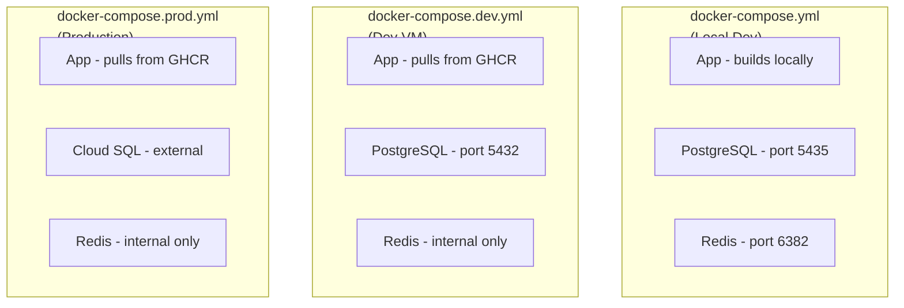
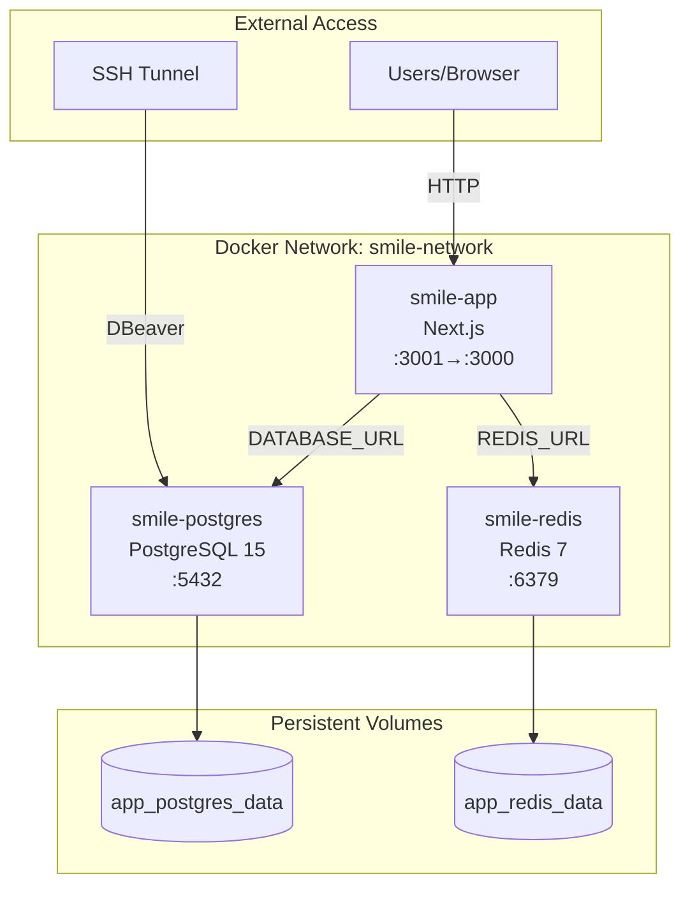
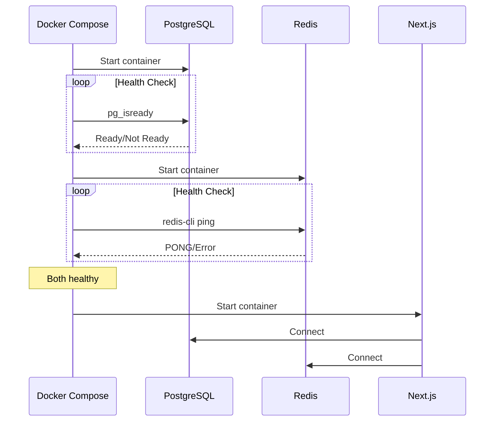
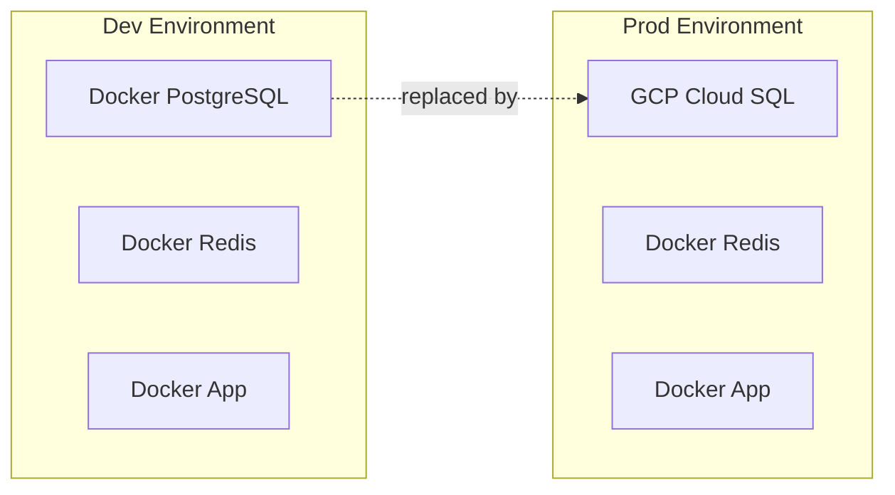
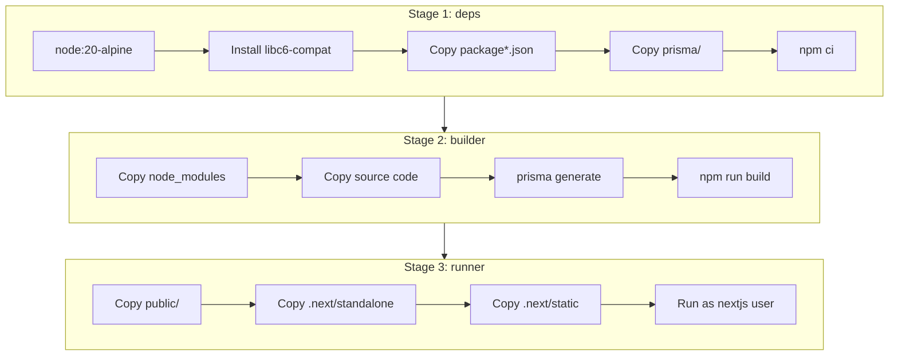
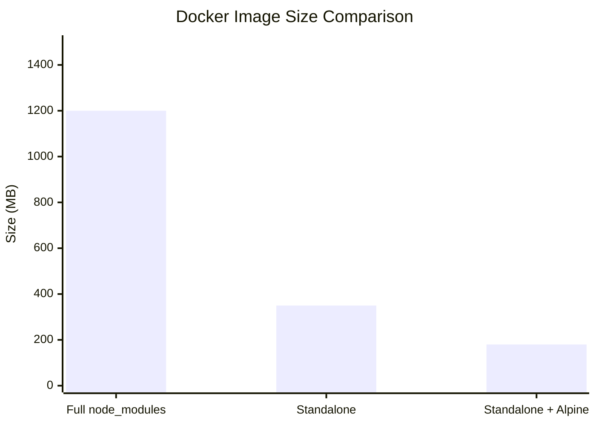
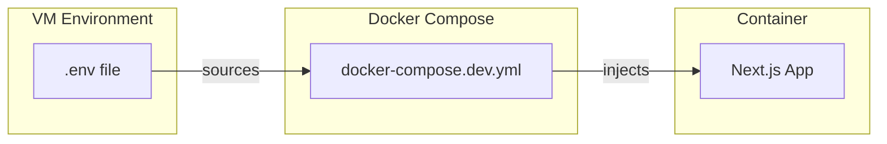
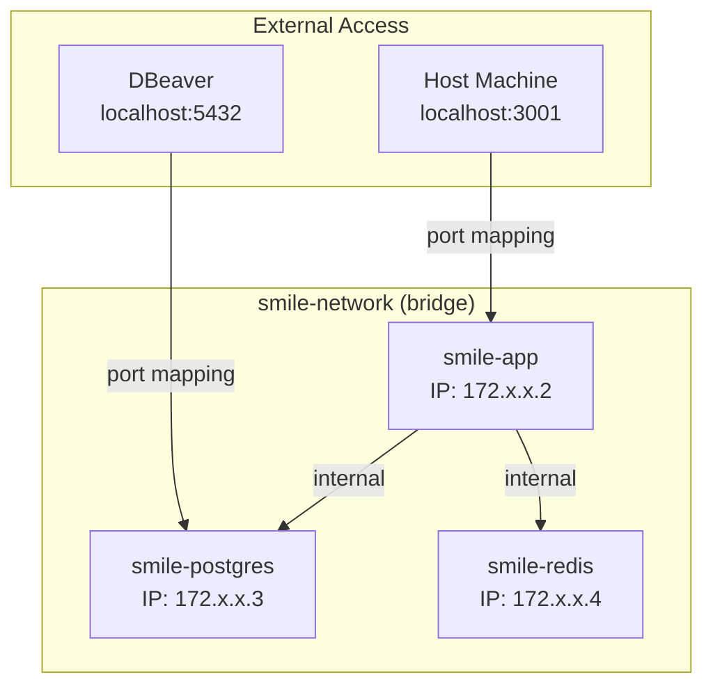

# Docker Configuration Guide

## Overview

The SMILE application uses Docker for containerization with three Docker Compose configurations for different environments.

---

## Docker Compose Files

| File | Environment | Use Case |
|------|-------------|----------|
| `docker-compose.yml` | Local Development | Building and running locally |
| `docker-compose.dev.yml` | Dev VM (GCP) | Deployed development server |
| `docker-compose.prod.yml` | Production VM | Production deployment |

### File Comparison



---

## Service Architecture

### Dev Environment Stack



---

## Docker Compose: docker-compose.dev.yml

### Full Configuration

```yaml
# Dev VM Docker Compose (GCP Compute Engine)
services:
  # PostgreSQL Database
  db:
    image: postgres:15-alpine
    container_name: smile-postgres
    ports:
      - "5432:5432"
    environment:
      POSTGRES_DB: smile_new_db
      POSTGRES_USER: smile_user
      POSTGRES_PASSWORD: ${DB_PASSWORD:-simple_pass}
      POSTGRES_HOST_AUTH_METHOD: scram-sha-256
      POSTGRES_INITDB_ARGS: "--auth-host=scram-sha-256 --auth-local=trust"
    volumes:
      - postgres_data:/var/lib/postgresql/data
    healthcheck:
      test: ["CMD-SHELL", "pg_isready -U smile_user -d smile_new_db"]
      interval: 10s
      timeout: 5s
      retries: 5
    networks:
      - smile-network
    deploy:
      resources:
        limits:
          memory: 256M

  # Redis for Bull Queue
  redis:
    image: redis:7-alpine
    container_name: smile-redis
    command: redis-server --maxmemory 64mb --maxmemory-policy allkeys-lru
    volumes:
      - redis_data:/data
    healthcheck:
      test: ["CMD", "redis-cli", "ping"]
      interval: 10s
      timeout: 5s
      retries: 5
    networks:
      - smile-network
    deploy:
      resources:
        limits:
          memory: 64M

  # Next.js Application
  app:
    image: ${DOCKER_IMAGE:-smile-next-app:latest}
    container_name: ${CONTAINER_NAME:-smile-app}
    ports:
      - "${PORT:-3001}:3000"
    environment:
      - NODE_ENV=production
      - DATABASE_URL=postgresql://smile_user:${DB_PASSWORD}@db:5432/smile_new_db
      - REDIS_URL=redis://redis:6379
      # ... additional env vars from .env
    depends_on:
      db:
        condition: service_healthy
      redis:
        condition: service_healthy
    networks:
      - smile-network
    deploy:
      resources:
        limits:
          memory: 512M

networks:
  smile-network:
    driver: bridge

volumes:
  postgres_data:
    external: true
    name: app_postgres_data
  redis_data:
    external: true
    name: app_redis_data
```

### Key Configuration Details

#### External Volumes

Volumes are marked as `external: true` to persist data across deployments:

```yaml
volumes:
  postgres_data:
    external: true
    name: app_postgres_data
```

**Create before first deployment:**
```bash
docker volume create app_postgres_data
docker volume create app_redis_data
```

#### Health Checks

Services have health checks for dependency ordering:



#### Memory Limits

Resource constraints prevent container OOM:

| Service | Memory Limit | Reason |
|---------|--------------|--------|
| PostgreSQL | 256M | Sufficient for dev workload |
| Redis | 64M | In-memory caching |
| App | 512M | Next.js server-side rendering |

---

## Docker Compose: docker-compose.prod.yml

### Differences from Dev



### Key Differences

| Aspect | Dev | Prod |
|--------|-----|------|
| Database | Docker container | GCP Cloud SQL (planned) |
| Port | 3001 | 3000 (or 80) |
| DB host | `db` (container) | Cloud SQL IP |
| Volume | `app_postgres_data` | N/A (managed by GCP) |

---

## Dockerfile

### Multi-Stage Build



### Full Dockerfile

```dockerfile
FROM node:20-alpine AS base

# Stage 1: Dependencies
FROM base AS deps
RUN apk add --no-cache libc6-compat
WORKDIR /app
COPY package.json package-lock.json* ./
COPY prisma ./prisma/
RUN npm ci

# Stage 2: Builder
FROM base AS builder
WORKDIR /app
COPY --from=deps /app/node_modules ./node_modules
COPY . .
RUN npx prisma generate
ENV NEXT_TELEMETRY_DISABLED=1
ENV NODE_OPTIONS=--max-old-space-size=1536
RUN npm run build

# Stage 3: Runner
FROM base AS runner
WORKDIR /app
ENV NODE_ENV=production
ENV NEXT_TELEMETRY_DISABLED=1

RUN addgroup --system --gid 1001 nodejs
RUN adduser --system --uid 1001 nextjs

COPY --from=builder /app/public ./public
RUN mkdir .next
RUN chown nextjs:nodejs .next

COPY --from=builder --chown=nextjs:nodejs /app/.next/standalone ./
COPY --from=builder --chown=nextjs:nodejs /app/.next/static ./.next/static

USER nextjs
EXPOSE 3000
ENV PORT=3000
ENV HOSTNAME="0.0.0.0"

CMD ["node", "server.js"]
```

### Build Optimization Features

| Feature | Purpose |
|---------|---------|
| Multi-stage build | Reduce final image size |
| Alpine base | Minimal OS footprint |
| Standalone output | Only include needed files |
| Non-root user | Security best practice |
| Memory limit | Prevent OOM during build |

### Image Size Comparison



---

## Environment Variables

### Required Variables

```yaml
# Authentication
AUTH_SECRET: Required for NextAuth
NEXTAUTH_URL: Public URL of the application
NEXT_PUBLIC_APP_URL: Client-side app URL

# Database
DATABASE_URL: PostgreSQL connection string
DB_PASSWORD: Database password

# Redis
REDIS_URL: Redis connection string

# Optional: AI Services
OPENAI_API_KEY: OpenAI API key
ANTHROPIC_API_KEY: Anthropic API key

# Optional: OAuth
GOOGLE_CLIENT_ID: Google OAuth client ID
GOOGLE_CLIENT_SECRET: Google OAuth secret
```

### Variable Flow



---

## Common Operations

### Start Services

```bash
# Dev environment
docker compose -f docker-compose.dev.yml up -d

# Local development
docker compose up -d --build
```

### Stop Services

```bash
# Stop and keep volumes
docker compose -f docker-compose.dev.yml down

# Stop and remove volumes (DATA LOSS!)
docker compose -f docker-compose.dev.yml down -v
```

### View Logs

```bash
# All services
docker compose -f docker-compose.dev.yml logs -f

# Specific service
docker compose -f docker-compose.dev.yml logs -f app

# Last 100 lines
docker compose -f docker-compose.dev.yml logs --tail=100 app
```

### Rebuild Image

```bash
# Rebuild and restart
docker compose -f docker-compose.dev.yml up -d --build

# Force recreate containers
docker compose -f docker-compose.dev.yml up -d --force-recreate
```

### Access Container Shell

```bash
# App container
docker exec -it smile-app sh

# PostgreSQL
docker exec -it smile-postgres psql -U smile_user -d smile_new_db

# Redis
docker exec -it smile-redis redis-cli
```

### Check Status

```bash
# Container status
docker compose -f docker-compose.dev.yml ps

# Resource usage
docker stats

# Volume info
docker volume ls
docker volume inspect app_postgres_data
```

---

## Network Configuration

### Docker Network

All services use a bridge network for internal communication:



### DNS Resolution

Containers can reach each other by service name:

| From | To | Hostname | Example |
|------|-----|----------|---------|
| app | db | `db` | `postgresql://smile_user:pass@db:5432/smile_new_db` |
| app | redis | `redis` | `redis://redis:6379` |

---

## Troubleshooting

### Container Won't Start

```bash
# Check logs
docker compose -f docker-compose.dev.yml logs app

# Check container status
docker ps -a

# Inspect container
docker inspect smile-app
```

### Database Connection Issues

```bash
# Test PostgreSQL from app container
docker exec smile-app node -e "
  const { PrismaClient } = require('@prisma/client');
  const prisma = new PrismaClient();
  prisma.\$connect().then(() => console.log('Connected!')).catch(console.error);
"

# Direct PostgreSQL test
docker exec smile-postgres pg_isready -U smile_user -d smile_new_db
```

### Volume Issues

```bash
# List volumes
docker volume ls

# Inspect volume
docker volume inspect app_postgres_data

# Recreate volume (DATA LOSS!)
docker volume rm app_postgres_data
docker volume create app_postgres_data
```

### Port Conflicts

```bash
# Check what's using a port
lsof -i :3001
lsof -i :5432

# Kill process using port
kill -9 $(lsof -t -i:3001)
```

---

## Related Documentation

- [CI/CD Overview](./cicd-deployment.md) - Pipeline overview
- [GitHub Actions](./github-actions.md) - Workflow details
- [VM Setup Guide](./vm-setup.md) - Environment configuration
- [Troubleshooting](./deployment-troubleshooting.md) - Common issues

---

*This document is maintained by AI agents. Last updated: 2026-01-17*
