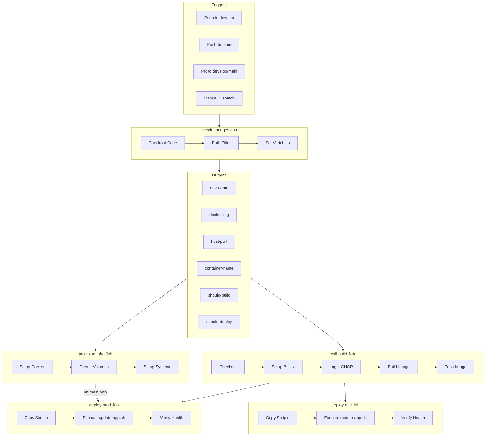
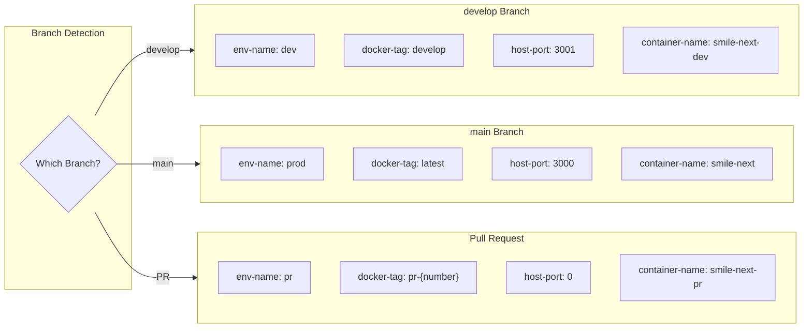
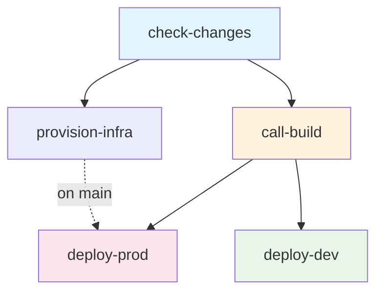
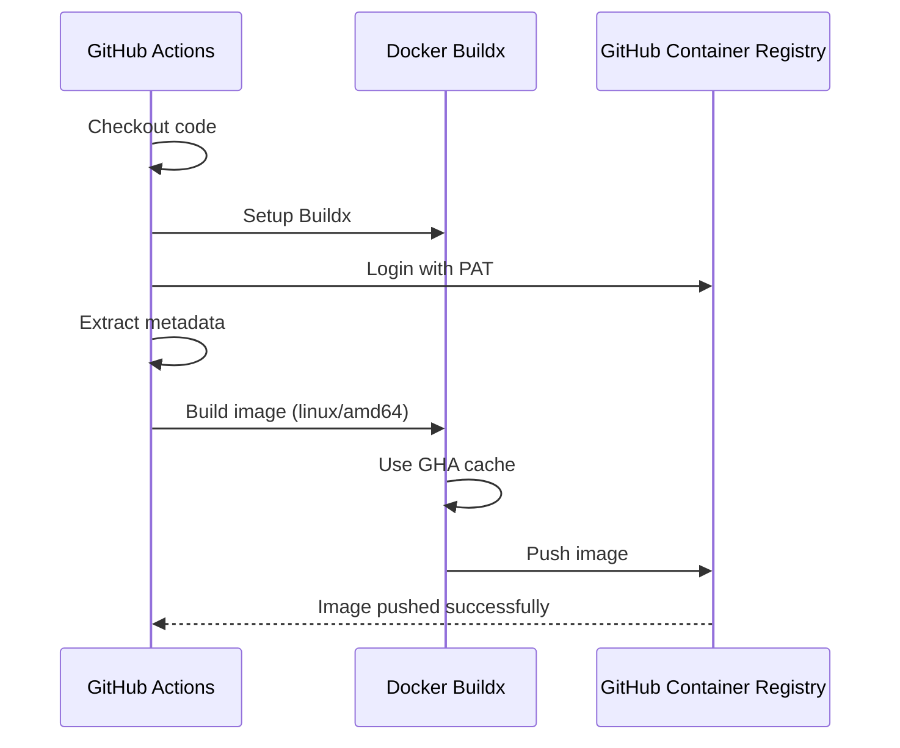
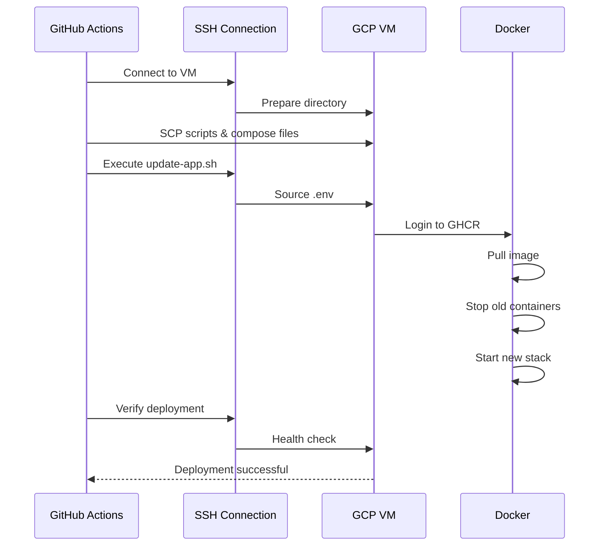
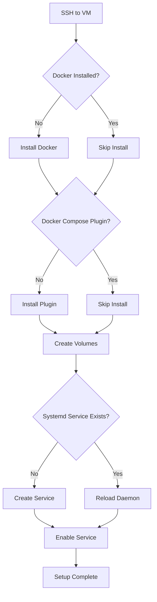

# GitHub Actions Workflows

## Overview

The SMILE application uses GitHub Actions for continuous integration and deployment. The workflows are modular and reusable, following the DRY principle.

---

## Workflow Files

| File | Type | Purpose |
|------|------|---------|
| `ci-cd.yml` | Orchestrator | Main workflow that coordinates all jobs |
| `build-node.yml` | Reusable | Builds and pushes Docker image to GHCR |
| `deploy-gcp-compute-vm-ssh.yml` | Reusable | Deploys to GCP VM via SSH |
| `setup-vm.yml` | Reusable | Provisions VM infrastructure |

---

## Pipeline Flow

### Complete Workflow Diagram



---

## Workflow: ci-cd.yml

### Triggers

```yaml
on:
  push:
    branches:
      - develop
      - main
  pull_request:
    branches:
      - develop
      - main
  workflow_dispatch:
    # Manual trigger
```

### Environment Variables by Branch



### Path Filters

The pipeline only runs when relevant files change:

```yaml
filters:
  src:
    - 'src/**'
    - 'public/**'
    - 'package*.json'
    - 'Dockerfile'
    - 'next.config.*'
    - '.env*'
    - 'prisma/**'
  infra:
    - 'scripts/deploy/**'
    - 'docker-compose.*.yml'
    - '.github/workflows/deploy-gcp-compute-vm-ssh.yml'
    - '.github/workflows/setup-vm.yml'
```

### Job Dependencies



---

## Workflow: build-node.yml

### Purpose

Reusable workflow that builds the Docker image and pushes it to GitHub Container Registry (GHCR).

### Inputs

| Input | Type | Required | Description |
|-------|------|----------|-------------|
| `docker-tag` | string | Yes | Tag for the Docker image |
| `image-name` | string | Yes | Full image name (e.g., ghcr.io/org/repo) |

### Build Process



### Image Tags

Each build produces two tags:

1. **Primary tag**: Based on input (e.g., `develop`, `latest`, `pr-123`)
2. **SHA tag**: `{branch}-{short-sha}` (e.g., `develop-abc1234`)

### Caching

Uses GitHub Actions cache for Docker layers:

```yaml
cache-from: type=gha
cache-to: type=gha,mode=max
```

---

## Workflow: deploy-gcp-compute-vm-ssh.yml

### Purpose

Reusable workflow that deploys the application to a GCP Compute VM via SSH.

### Inputs

| Input | Type | Required | Description |
|-------|------|----------|-------------|
| `environment` | string | Yes | Environment name (dev/prod) |
| `port` | string | Yes | Host port for the application |
| `docker-tag` | string | Yes | Docker image tag to deploy |
| `container-name` | string | Yes | Name for the container |
| `image-name` | string | Yes | Full image name |

### Deployment Process



### Deployment Steps Detail

1. **Prepare Directory**
   ```bash
   mkdir -p ~/smile-next
   # Preserve .env file
   rm -rf ~/smile-next/scripts
   ```

2. **Copy Files**
   - `scripts/deploy/*`
   - `docker-compose.dev.yml`
   - `docker-compose.prod.yml`

3. **Execute Deploy**
   ```bash
   bash scripts/deploy/update-app.sh $ENV $TAG $IMAGE $CONTAINER $PORT
   ```

4. **Verify Health**
   ```bash
   bash scripts/deploy/verify-deployment.sh $CONTAINER
   ```

---

## Workflow: setup-vm.yml

### Purpose

Provisions infrastructure on the VM (Docker, volumes, systemd service).

### Triggers

- Called by `ci-cd.yml` when infrastructure changes on main branch
- Can be triggered manually via `workflow_dispatch`

### Provisioning Steps



### Created Resources

| Resource | Name | Description |
|----------|------|-------------|
| Docker Volume | `app_postgres_data` | PostgreSQL data (dev only) |
| Docker Volume | `app_redis_data` | Redis data |
| Systemd Service | `smile-next-{env}.service` | Container management |

---

## Required Secrets

### GitHub Repository Secrets

| Secret | Description | How to Create |
|--------|-------------|---------------|
| `GHCR_PAT` | Personal Access Token for GHCR | GitHub → Settings → Developer Settings → PAT |
| `GHCR_USERNAME` | GitHub username | Your GitHub username |
| `VM_HOST` | VM IP or hostname | From GCP Console |
| `VM_USERNAME` | SSH username | e.g., `your-gcp-username` |
| `SSH_PRIVATE_KEY` | Private SSH key | Generate with `ssh-keygen` |

### PAT Required Scopes

For `GHCR_PAT`:
- `read:packages`
- `write:packages`
- `delete:packages` (optional)

### GitHub Environments

Configure in Repository Settings → Environments:

1. **dev**
   - No protection rules
   - Auto-deploy on push

2. **prod**
   - Optional: Required reviewers
   - Optional: Wait timer

---

## Workflow Customization

### Adding a New Environment

1. Update `check-changes` job in `ci-cd.yml`:
   ```yaml
   elif [ "${{ github.ref }}" == "refs/heads/staging" ]; then
     echo "env-name=staging" >> $GITHUB_OUTPUT
     echo "docker-tag=staging" >> $GITHUB_OUTPUT
     echo "host-port=3002" >> $GITHUB_OUTPUT
     echo "container-name=smile-next-staging" >> $GITHUB_OUTPUT
   ```

2. Add new deploy job:
   ```yaml
   deploy-staging:
     needs: [check-changes, call-build]
     if: github.ref == 'refs/heads/staging'
     uses: ./.github/workflows/deploy-gcp-compute-vm-ssh.yml
     # ...
   ```

3. Create GitHub Environment `staging`
4. Set environment-specific secrets

### Modifying Build Settings

Update `build-node.yml`:

```yaml
# Add multi-platform support
platforms: linux/amd64,linux/arm64

# Change cache strategy
cache-from: type=registry,ref=${{ inputs.image-name }}:cache
cache-to: type=registry,ref=${{ inputs.image-name }}:cache,mode=max
```

---

## Debugging Workflows

### View Workflow Runs

1. Go to repository → Actions tab
2. Select workflow run
3. Click on job to see logs

### Re-run Failed Jobs

1. Open failed workflow run
2. Click "Re-run failed jobs"
3. Or click "Re-run all jobs"

### Manual Trigger

1. Go to Actions → "Deploy SMILE Next Application"
2. Click "Run workflow"
3. Select branch
4. Click "Run workflow"

### Common Issues

| Issue | Cause | Solution |
|-------|-------|----------|
| Build fails with OOM | Node.js memory limit | Increase `NODE_OPTIONS` in Dockerfile |
| GHCR login fails | PAT expired/invalid | Regenerate PAT, update secret |
| SSH connection fails | Wrong key or IP | Verify secrets match VM |
| Health check timeout | App slow to start | Increase retry count in verify script |

---

## Related Documentation

- [CI/CD Overview](./cicd-deployment.md) - Main overview
- [Docker Configuration](./docker-configuration.md) - Docker setup details
- [VM Setup Guide](./vm-setup.md) - Environment configuration
- [Troubleshooting](./deployment-troubleshooting.md) - Common issues

---

*This document is maintained by AI agents. Last updated: 2026-01-17*
