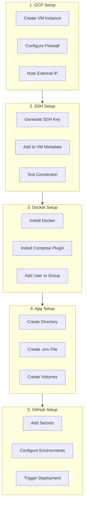
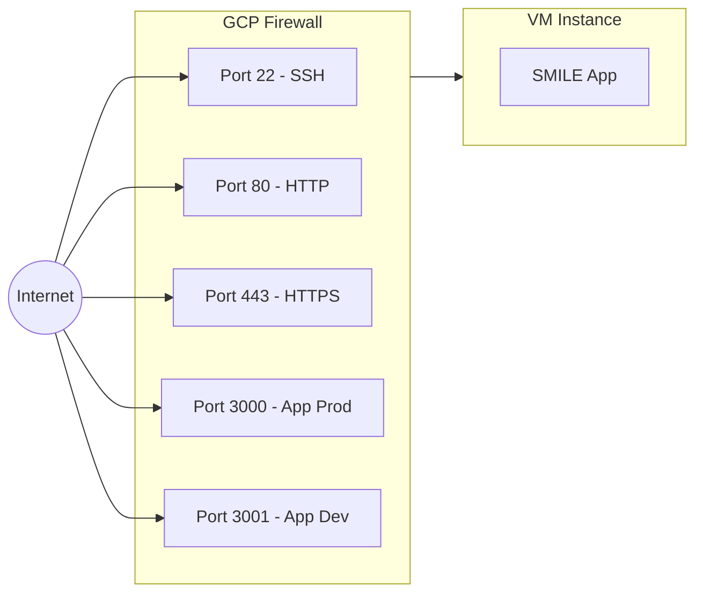
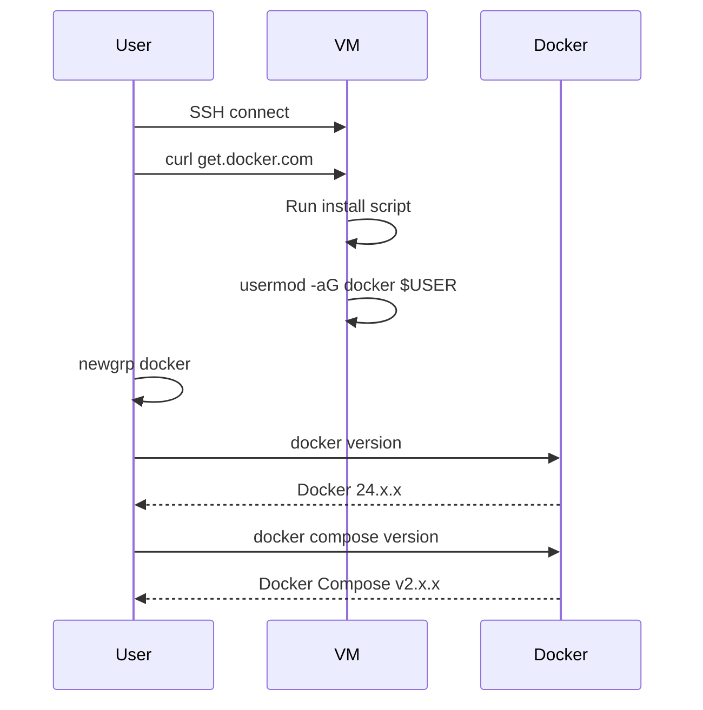
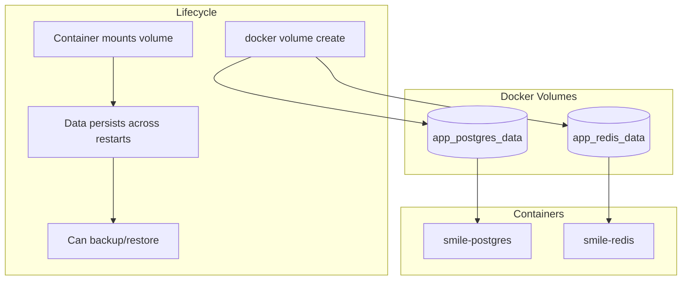
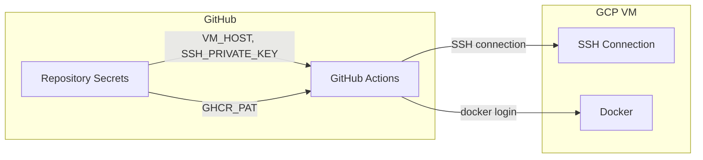
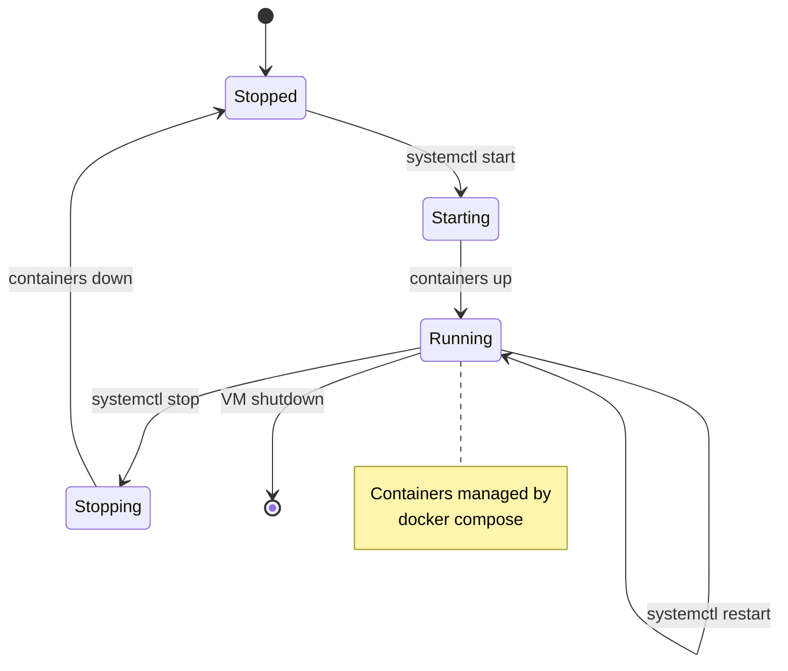

# VM Setup Guide

## Overview

This guide covers the first-time setup of a GCP Compute Engine VM for the SMILE application deployment.

---

## Prerequisites

- GCP account with Compute Engine access
- SSH key pair for VM access
- GitHub repository access
- Required API keys (OpenAI, etc.)

---

## Setup Workflow



---

## Step 1: GCP VM Creation

### Create VM Instance

1. Go to GCP Console → Compute Engine → VM Instances
2. Click "Create Instance"

### Recommended Configuration

| Setting | Dev | Prod |
|---------|-----|------|
| Machine Type | e2-small (2 vCPU, 2GB) | e2-medium (2 vCPU, 4GB) |
| Boot Disk | 20GB SSD | 40GB SSD |
| OS | Debian 11 or Ubuntu 22.04 | Debian 11 or Ubuntu 22.04 |
| Region | Your preferred region | Low-latency region |

### Firewall Rules

Allow these ports:



**Create firewall rule:**

```bash
gcloud compute firewall-rules create allow-smile-ports \
  --allow tcp:22,tcp:80,tcp:443,tcp:3000,tcp:3001 \
  --source-ranges 0.0.0.0/0 \
  --target-tags smile-server

# Apply tag to VM
gcloud compute instances add-tags YOUR_VM_NAME \
  --tags smile-server \
  --zone YOUR_ZONE
```

---

## Step 2: SSH Configuration

### Generate SSH Key (if needed)

```bash
# Generate key pair
ssh-keygen -t ed25519 -C "smile-deploy" -f ~/.ssh/smile-deploy

# View public key (add to GCP)
cat ~/.ssh/smile-deploy.pub

# View private key (add to GitHub Secrets)
cat ~/.ssh/smile-deploy
```

### Add Key to GCP

1. Go to Compute Engine → Metadata → SSH Keys
2. Click "Edit" → "Add Item"
3. Paste public key
4. Save

### Test Connection

```bash
ssh -i ~/.ssh/smile-deploy YOUR_USERNAME@VM_EXTERNAL_IP
```

---

## Step 3: Docker Installation

### Install Docker

```bash
# Update packages
sudo apt-get update

# Install Docker
curl -fsSL https://get.docker.com -o get-docker.sh
sudo sh get-docker.sh

# Add user to docker group
sudo usermod -aG docker $USER

# Apply group changes (or log out/in)
newgrp docker

# Verify
docker --version
```

### Install Docker Compose Plugin

```bash
# Install plugin
sudo apt-get update
sudo apt-get install -y docker-compose-plugin

# Verify
docker compose version
```

### Docker Installation Diagram



---

## Step 4: Application Setup

### Create Directory Structure

```bash
# Create project directory
mkdir -p ~/smile-next
cd ~/smile-next
```

### Create .env File

```bash
# Create and edit .env
nano ~/smile-next/.env
```

**Required Environment Variables:**

```bash
# =============================================
# SMILE Application Environment Variables
# =============================================

# Authentication (REQUIRED)
AUTH_SECRET=your-secure-random-string-here
NEXTAUTH_URL=https://dev.your-domain.com
NEXT_PUBLIC_APP_URL=https://dev.your-domain.com

# Database (REQUIRED)
DB_PASSWORD=your-secure-db-password
DATABASE_URL=postgresql://smile_user:your-secure-db-password@db:5432/smile_new_db

# =============================================
# AI Services (at least one required for evaluation)
# =============================================

# OpenAI
OPENAI_API_KEY=sk-proj-...
OPENAI_MODEL=gpt-4o

# Anthropic (backup)
ANTHROPIC_API_KEY=sk-ant-...
ANTHROPIC_MODEL=claude-sonnet-4-5-20250929

# =============================================
# OAuth (optional but recommended)
# =============================================

# Google OAuth
GOOGLE_CLIENT_ID=your-client-id.apps.googleusercontent.com
GOOGLE_CLIENT_SECRET=your-client-secret

# =============================================
# Email (optional)
# =============================================

SMTP_HOST=smtp.gmail.com
SMTP_PORT=587
SMTP_USER=your-email@gmail.com
SMTP_PASSWORD=your-app-password
EMAIL_FROM=your-email@gmail.com

# =============================================
# Application Settings
# =============================================

# Disable workers if needed
DISABLE_WORKERS=false
```

### Generate AUTH_SECRET

```bash
# Generate a secure random string
openssl rand -base64 32
```

### Create Docker Volumes

```bash
# Create persistent volumes
docker volume create app_postgres_data
docker volume create app_redis_data

# Verify
docker volume ls
```

### Volume Management Diagram



---

## Step 5: GitHub Configuration

### Add Repository Secrets

Go to: Repository → Settings → Secrets and variables → Actions

| Secret | Value | Description |
|--------|-------|-------------|
| `GHCR_PAT` | Your GitHub PAT | Container registry access |
| `GHCR_USERNAME` | Your GitHub username | Registry username |
| `VM_HOST` | VM external IP | e.g., `34.123.45.67` |
| `VM_USERNAME` | SSH username | e.g., `your-gcp-username` |
| `SSH_PRIVATE_KEY` | Full private key | Include `-----BEGIN...` and `-----END...` |

### Create GitHub PAT

1. GitHub → Settings → Developer settings → Personal access tokens
2. Generate new token (classic)
3. Select scopes:
   - `read:packages`
   - `write:packages`
4. Copy token (shown only once!)

### Configure Environments

Go to: Repository → Settings → Environments

**Create `dev` environment:**
- No protection rules needed
- Auto-deploy on push to `develop`

**Create `prod` environment (optional):**
- Add required reviewers
- Add wait timer if needed

### GitHub Secrets Flow



---

## Step 6: First Deployment

### Option A: Automatic (Recommended)

Push to `develop` branch to trigger deployment:

```bash
git checkout develop
git push origin develop
```

### Option B: Manual Trigger

1. Go to Actions → "Deploy SMILE Next Application"
2. Click "Run workflow"
3. Select `develop` branch
4. Click "Run workflow"

### Option C: Manual SSH Deployment

```bash
# SSH to VM
ssh -i ~/.ssh/smile-deploy user@vm-ip

# Navigate to project
cd ~/smile-next

# Login to GHCR
echo $GHCR_PAT | docker login ghcr.io -u USERNAME --password-stdin

# Pull image
docker pull ghcr.io/tedahn-pknic/new_smile_flask:develop

# Set environment variables
export DOCKER_IMAGE=ghcr.io/tedahn-pknic/new_smile_flask:develop
export PORT=3001
export CONTAINER_NAME=smile-next-dev

# Start services
docker compose -f docker-compose.dev.yml up -d
```

---

## Step 7: Verification

### Check Container Status

```bash
docker compose -f docker-compose.dev.yml ps
```

Expected output:
```
NAME             IMAGE                                  STATUS
smile-app        ghcr.io/.../new_smile_flask:develop   Up (healthy)
smile-postgres   postgres:15-alpine                    Up (healthy)
smile-redis      redis:7-alpine                        Up (healthy)
```

### Check Health Endpoint

```bash
curl http://localhost:3001/api/health
```

Expected response:
```json
{
  "status": "ok",
  "timestamp": "2026-01-17T...",
  "checks": {
    "database": { "status": "ok", "latencyMs": 5 },
    "redis": { "status": "ok" }
  }
}
```

### Check Logs

```bash
# All services
docker compose -f docker-compose.dev.yml logs -f

# Just the app
docker compose -f docker-compose.dev.yml logs -f app
```

---

## Systemd Service Setup

The deployment script automatically sets up a systemd service for container management.

### Service File Location

```
/etc/systemd/system/smile-next-dev.service
```

### Service Commands

```bash
# Check status
sudo systemctl status smile-next-dev

# Start service
sudo systemctl start smile-next-dev

# Stop service
sudo systemctl stop smile-next-dev

# Restart service
sudo systemctl restart smile-next-dev

# View logs
sudo journalctl -u smile-next-dev -f
```

### Service Lifecycle



---

## Directory Structure After Setup

```
~/smile-next/
├── .env                    # Environment variables (created manually)
├── docker-compose.dev.yml  # Copied by CI/CD
├── docker-compose.prod.yml # Copied by CI/CD
└── scripts/
    └── deploy/
        ├── update-app.sh
        ├── verify-deployment.sh
        ├── validate-env.sh
        └── setup-systemd-service.sh
```

---

## Security Considerations

### SSH Access

- Use key-based authentication only
- Disable password authentication
- Consider using GCP OS Login for better access control

### Firewall

- Only open necessary ports
- Use GCP firewall rules (not iptables)
- Consider using Cloud Armor for DDoS protection

### Secrets

- Never commit `.env` to git
- Rotate API keys regularly
- Use GitHub Environments for additional protection

### Container Security

- Containers run as non-root user
- Resource limits prevent DoS
- Regular image updates for security patches

---

## Maintenance Tasks

### Update Application

Deployments happen automatically on push. For manual update:

```bash
cd ~/smile-next
docker compose -f docker-compose.dev.yml pull
docker compose -f docker-compose.dev.yml up -d
```

### Database Backup

```bash
# Backup
docker exec smile-postgres pg_dump -U smile_user smile_new_db > backup.sql

# Restore
docker exec -i smile-postgres psql -U smile_user smile_new_db < backup.sql
```

### Clean Up

```bash
# Remove old images
docker image prune -af --filter "until=24h"

# Remove unused volumes (CAREFUL - data loss!)
docker volume prune

# System cleanup
docker system prune -a
```

---

## Related Documentation

- [CI/CD Overview](./cicd-deployment.md) - Pipeline overview
- [GitHub Actions](./github-actions.md) - Workflow details
- [Docker Configuration](./docker-configuration.md) - Container setup
- [Troubleshooting](./deployment-troubleshooting.md) - Common issues

---

*This document is maintained by AI agents. Last updated: 2026-01-17*
